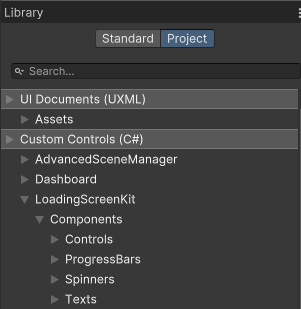

# Quick Start Guide

This guide assumes you've installed the package from your package manager. It's recommended to download the provided sample and use it as the foundation for your new loading screen. The sample includes:

- A loading screen scene
- A loading screen script
- A sample UI document
- A sample USS document

These components together form a complete loading screen setup.

## Components Overview

The package offers various components to create and customize your loading screens:

### Controls

Control components manage different functionalities, such as passing values to child elements or handling specific behaviors. Key controls include:

- [**TotalProgressController**](Controls/TotalProgressController.md): Updates the total progress value for scenes and communicates it to child elements that listen for this data. Note that Total progress cannot predict dynamically loading data after scene load.

- [**SimpleProgressController**](Controls/SimpleProgressController.md): A simple version of the progress controller that sends current loading progress to listening child elements.

- [**PressAnyKeyContinueController**](Controls/SimpleProgressController.md): Waits for user input to proceed once loading is complete.

- [**VisualController**](Controls/VisualController.md): A visual element designed for styling and passing events to child elements. Use it to add a parent to a progress bar to add another level in a controller.

### Progress Bars

The package provides various progress bars that listen to float values and can be placed as children of controllers that update their values. The available types are:

- [**Arc**](ProgressBars/ArcProgressBar.md): Displays progress in a circular arc format.

- [**Linear**](ProgressBars/LinearProgressBar.md): Represents progress in a linear bar format.

>Make sure to import Default.uss into your document as progress bars do require some extra styling.

### Spinners

Spinners are graphical elements commonly used in loading screens. They do not listen to events and can be styled as desired.

### Texts

Text elements can listen to various events, such as progress updates or displaying quotes.

## Accessing Components

If you're familiar with UXML, you can find the components under the `LoadingScreenKit` namespace. For those using the UI Builder, navigate to **UIBuilder > Library > Project > Custom Controls > LoadingScreenKit** to access the components.

By utilizing these components, you can create a customized and visually appealing loading screen tailored to your project's needs.
