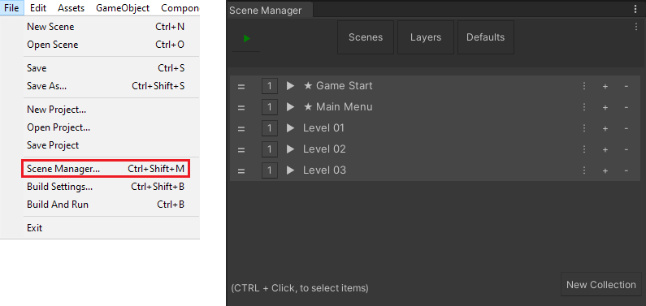

## What is Advanced Scene Manager?

Advanced Scene Manager is a new and improved scene management system for [Unity](https://unity.com/). Get it at the [Unity Asset Store!](https://assetstore.unity.com/packages/slug/174152)

Advanced Scene Manager allows you to assign [scenes](docs/Scene.md) as children to a [Scene Collection](docs/SceneCollection.md) (commonly referred to as collections).
When a [Scene Collection](docs/SceneCollection.md) is opened all existing scenes will be closed and the newly opened [Scene Collection](docs/SceneCollection.md) will have its associated [scenes](docs/Scene.md) opened.

Only one [collection](docs/SceneCollection.md) can be open at a time, but individual [scenes](docs/SceneCollection.md) can still be opened as standalone.

## How do I use it?

The [Scene Manager Window](docs/SceneManagerWindow.md) can be accessed from 'File -> Scene Manager...' menu item. The [Scene Manager window](docs/SceneManagerWindow.md) can be used to create and remove [collections](docs/SceneCollection.md) and assign any [scenes](docs/Scene.md) as children.



[Collections](docs/SceneCollection.md) and [scenes](docs/Scene.md) can be used like this:


or like this:

```C#
using UnityEngine;
using AdvancedSceneManager;

public MyScript : MonoBehaviour
{

    public SceneCollection collection;
    public Scene scene;

    public void DoStuff()
    {     

        //All collection functions use a loading screen, if one is defined
        collection.Open();         //Close all existing scenes and open scenes in collection
        collection.Reopen();       //Closes collection and then opens it again
        collection.Close();        //Closes all scenes
        collection.Toggle();       //Toggles the collection on or off
        collection.Toggle(true);   //Makes sure the collection is open
        collection.Toggle(false);  //Makes sure the collection is closed

        //All scene functions open it as stand-alone (without collection), but scenes that are
        //contained within the currently open collection can be used in functions in SceneManager.collection
        scene.Open();         //Opens the scene, stand-alone, additive
        scene.OpenSingle();   //Opens the scene, stand-alone, closes all existing scenes and collections
        scene.Close();        //Closes the scene, stand-alone
        scene.Toggle();       //Toggles the scene on or off, stand-alone
        scene.Toggle(true);   //Makes sure that the scene is open, stand-alone
        scene.Toggle(false);  //Makes sure that the scene is closed, stand-alone

        //All the above are proxy functions for functions in SceneManager.standalone or SceneManager.collection
        SceneManager.standalone.Open(scene);
        SceneManager.collection.Open(collection);

    }

}
```

</br>

[Collections](docs/SceneCollection.md) and [scenes](docs/Scene.md) can also be opened from [UnityEvents](https://docs.unity3d.com/Manual/UnityEvents.html), such as from a [Button](https://docs.unity3d.com/Packages/com.unity.ugui@1.0/manual/script-Button.html), but it might be easier to use the [SceneHelper](docs/SceneHelper.md), since that will make it easier to find the [scene](docs/Scene.md) or [collection](docs/SceneCollection.md) in the Object Picker.

## Wiki
###### Advanced Scene Manager
Welcome to the Advanced Scene Manager wiki!\
This wiki is available both [online](https://github.com/Lazy-Solutions/AdvancedSceneManager/blob/main/docs/readme.md) and [offline](https://raw.githubusercontent.com/wiki/Lazy-Solutions/AdvancedSceneManager/docs/ToPdf/ASM.pdf)

>Note: the offline version packaged with asset store releases may not be up-to-date, since documentation may be updated after release.

###### Patches
Patches are partial updates that are too important to have our users wait for, and if you are having issues, have a look over here, it might be fixed already: \
[Patches](https://github.com/Lazy-Solutions/AdvancedSceneManager/tree/main/patches)

###### Contact
Want to get into contact with us? Report issues?\
[Github issues](https://github.com/Lazy-Solutions/AdvancedSceneManager/issues)\
[support@lazy.solutions](mailto:support@lazy.solutions)\
[discord.gg/pnRn6zeFEJ](https://discord.gg/pnRn6zeFEJ)
>Note: We accept bug reports and offer help on all three channels. Which one you wish to use, is up to your preference!

###### Highlight ★
[Loading screens](LoadingScreen.md)\
[Splash screen](SplashScreen.md)\
[SceneHelper](SceneHelper.md)\
[ISceneOpened, ISceneClosed, ICollectionOpen, ICollectionClose](Callbacks.md)

###### Guides
[Quick start](QuickStart.md)\
[Loading screen](LoadingScreen.md#guide)\
[Splash screen](SplashScreen.md#guide)

###### Plugins
[Addressables support](plugin.asm.addressables.md)\
[Locking](plugin.asm.locking.md)\
[Cross-scene references (experimental)](plugin.asm.cross-scene-references.md)

###### Models
[Scene](Scene.md)\
[SceneCollection](SceneCollection.md)\
[Profile](Profile.md)

###### Frontend
[SceneManagerWindow](SceneManagerWindow.md)\
[SceneOverviewWindow](SceneOverviewWindow.md)

##### Backend
[SceneManager](SceneManager.md)\
[SceneOperation](SceneOperation.md)\
[SceneAction](SceneAction.md)\
[AssetManagement](AssetManagement.md)\
[OpenSceneInfo](OpenSceneInfo.md)\
[PreloadedSceneHelper](PreloadedSceneHelper.md)

###### Utilities
[SceneUtility](SceneUtility.md)\
[SceneCollectionUtility](SceneCollectionUtility.md)\
[LoadingScreenUtility](LoadingScreenUtility.md)\
[PersistentUtility](PersistentUtility.md)\
[CanvasSortOrderUtility](CanvasSortOrderUtility.md)\
[AssetRefreshUtility](AssetRefreshUtility.md)\
[Scene merge, split](SceneMergeSplit.md)\
[HierarchyGUIUtility](HierarchyGUIUtility.md)\
[SceneDataUtility](SceneDataUtility.md)\
[GuidReferenceUtility](GuidReferenceUtility.md)\
[CallbackUtility, Callback analyzer](CallbackUtility.md)

###### Misc
[In-game Toolbar](InGameToolbar.md)\
[DefaultPauseScreen](DefaultPauseScreen.md)

## Where can I get it!?
Advanced Scene Manager is available at the Unity Asset Store, [get it now!](https://assetstore.unity.com/packages/slug/174152)<br/>
