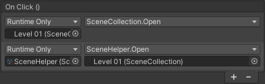
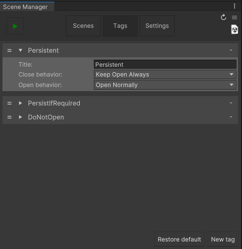
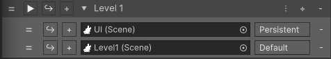
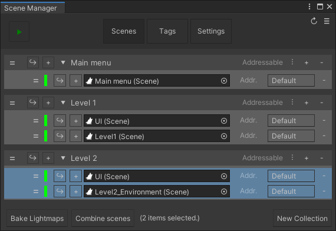
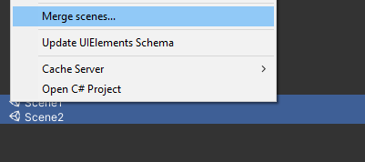
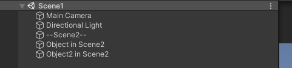
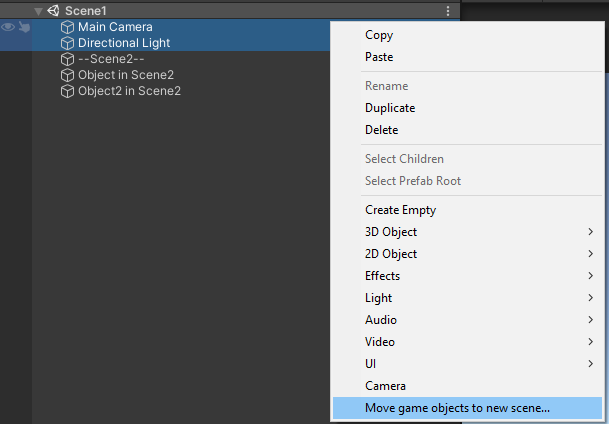

## Scenes

<br/>

An ASM scene is our representation of a [SceneAsset](https://docs.unity3d.com/ScriptReference/SceneAsset.html) Unity scene. All [SceneAssets](https://docs.unity3d.com/ScriptReference/SceneAsset.html) in the project will have a corresponding Scene [ScriptableObject](https://docs.unity3d.com/Manual/class-ScriptableObject.html) generated for it. Aside from the slight confusion that might arise at first, this approach has numerous advantages:

* Drag and drop references in inspector:

  

* [UnityEvent](https://docs.unity3d.com/ScriptReference/Events.UnityEvent.html) support (it might be easier to use [SceneHelper](SceneHelper.md) as target though, since that will help filter the [object picker](https://docs.unity3d.com/ScriptReference/EditorGUI.ObjectField.html) to only display scenes):

  

* More robust:

  Consider this:

```csharp
  using UnityEngine.SceneManagement;
  using AdvancedSceneManager.Models;

  //------Unity, Out-of-the-box------

  //Path: Loses reference when scene is moved, renamed, deleted...
  //Name: Loses reference when scene renamed, deleted, also
  //      conflicts occur when duplicate names exist...
  public string scene;

  //Loses reference when build index changes...
  public int sceneIndex;

  public void OpenSceneUnity()
  {
      SceneManager.LoadScene(scene);
      SceneManager.LoadScene(sceneIndex);
  }
```
Which could be transformed into this:
```csharp
  //------Advanced Scene Manager------

  //Is automatically updated when its associated SceneAsset is moved,
  //renamed and deleted.
  //Does not rely on build index.
  public Scene scene;

  public void OpenSceneASM()
  {
      scene.Open();
  }

```

### Persistent scenes
Scenes can be opened as persistent either by using [tags](SceneManagerWindow.md#tags):




Or by using [PersistentUtility](../api/AdvancedSceneManager.Utility.PersistentUtility.html) in code.

## Scene merge

Merging scenes can be done in two ways:<br/>
(API methods are contained in [SceneUtility](../api/AdvancedSceneManager.Utility.SceneUtility.html))

Pressing the  button:



Or by selecting two or more SceneAsset in project window:



The scenes will then be merged like this:




## Scene split
Scenes can be split by selecting two GameObjects in the hierarchy:



And will be split like this:


