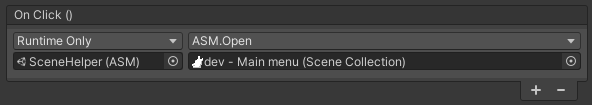

## Scene helper

<br/>

The scene helper is a [scriptable object](https://docs.unity3d.com/Manual/class-ScriptableObject.html) that can be used in [UnityEvent](https://docs.unity3d.com/ScriptReference/Events.UnityEvent.html) to easily open [scenes](Scene.md) or [collections](SceneCollection.md), since it might be easier to find [scenes](Scene.md) or [collections](SceneCollection.md) using it.



It may also be used through a singleton instance:
```csharp
AdvancedSceneManager.Utility.SceneHelper.current
```

API documentation can be found here:
[Scene helper](../api/AdvancedSceneManager.Utility.ASM.html)
