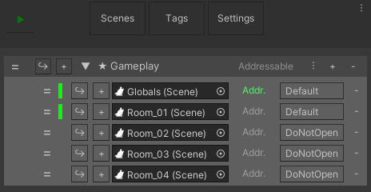

Addressables support package ([install instructions here](SupportPackages)) adds support to open and close addressable [scenes](Scene) in ASM.

This package automatically finds all [scenes](Scene) that are addressable and overrides default [scene](Scene) open and close behavior. Which means, after tweaking settings in addressables, ASM should just work like it usually does.

In addition to [scene](Scene) open and close support, a button is added to
[scenes](Scene) and [collections](SceneCollection) in ui.

Pressing 'Addr.' button on a [scene](Scene) toggles the [scene](Scene) as addressable.\
Pressing 'Addressable' on collection will toggle all [scenes](Scene) in [collection](SceneCollection) as addressable.

Please note:
> When ASM adds a [scene](Scene) to addressables, it will add it under a default group, named after the [collection](SceneCollection) the [scene](Scene) is contained in. This group will not have a schema assigned to it by ASM, and is expected to be assigned manually, or have all scenes reassigned to other groups.
