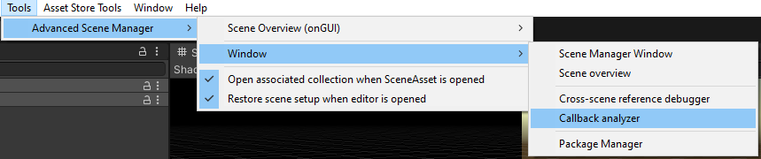
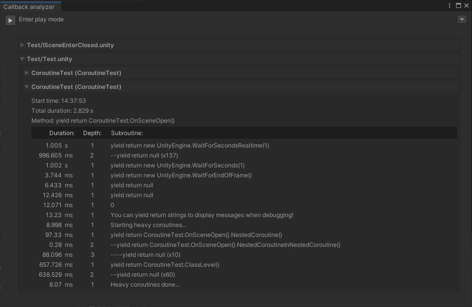

Callback utility can track coroutines and display an overview over how they perform. Only available in editor.

> Note that tracking is not 100% accurate and does on top of this, introduce overhead, so the callback analyzer is more of a quick way to see if there are any perfomance issues that needs resolving.\
</br>
For any serious performance optimization, callback analyzer is not the tool for the job, and industry tools that focuses only on diagnosing performance is recommended.

The callback analyzer window can be opened from:




> Yield return null is not combined by default,\
yield return CombineNull.value can be used to tell callback analyzer that this and subseqent nulls should be combined.\
</br>
Default Unity yield instructions, such as [WaitForSecondsRealtime](https://docs.unity3d.com/ScriptReference/WaitForSecondsRealtime.html), are automatically combined, even though they technically do not return CombineNull.value.

By default, only [ISceneOpen, ISceneClose, ICollectionOpen, ICollectionClose](Callbacks) callbacks are tracked, but user coroutines can also be tracked by setting enableDiag to true in StartCoroutine():
```csharp
MyCoroutine().StartCoroutine(enableDiag: true);

IEnumerator MyCoroutine()
{ ... }
 ```
