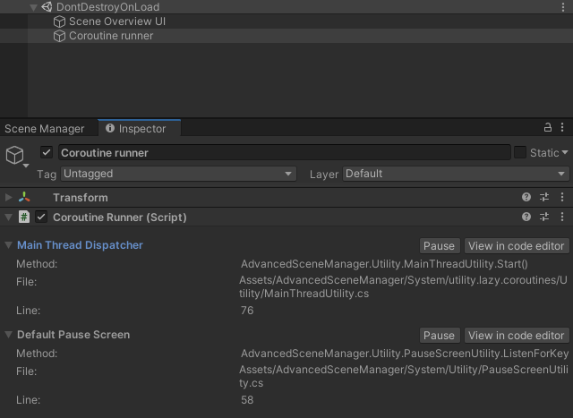

CoroutineUtility is a helper class that runs coroutines in [DontDestroyOnLoad](https://docs.unity3d.com/ScriptReference/Object.DontDestroyOnLoad.html), since running coroutines for opening and closing scenes won't work very well otherwise.

Coroutines can be run by CoroutineUtility like this:
```csharp
public class RunCoroutineScript : MonoBehaviour
{

    void Start()
    {

        //Just run it
        RunCoroutine().StartCoroutine();

        //If callback when done is desired
        RunCoroutine().StartCoroutine(OnComplete);

        //Presents a more readable message in the editor, more info below.
        RunCoroutine().StartCoroutine(debugText: "Waiting for 10 seconds.");

    }

    IEnumerator RunCoroutine()
    {
        yield return new WaitForSeconds(10);
    }

    void OnComplete()
    {
        Debug.Log("Wait complete!");
    }

}

```

The coroutines that are currently in progress using coroutine utility can be easily viewed by having a look at the object created in [DontDestroyOnLoad](https://docs.unity3d.com/ScriptReference/Object.DontDestroyOnLoad.html).



The open button opens the script in the editor at the line that called StartCoroutine().

The text displayed is the name of the method that returns the IEnumerator. This can be overriden by specifying debugText parameter in StartCoroutine().
