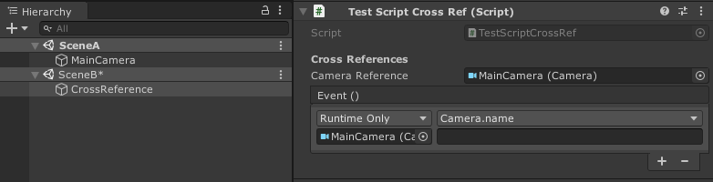
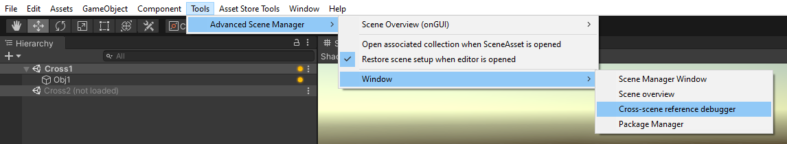
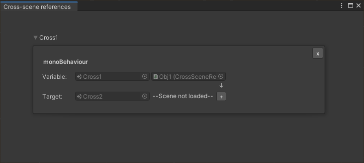
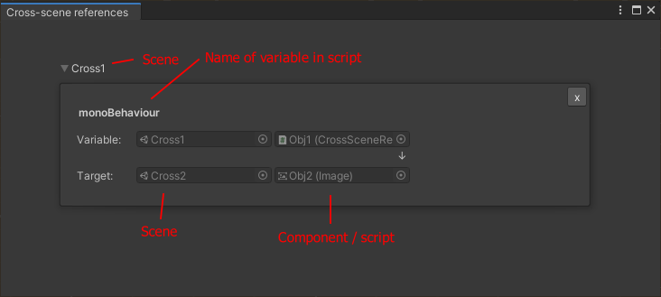

Cross scene references is one of those small things that should be supported by Unity, but just isn't. Fret not however, since as of ASM 1.1, that functionality is provided out-of-the-box, and may be enabled in settings.

> Note that cross-scene references may not be restored until after [Start()](https://docs.unity3d.com/ScriptReference/MonoBehaviour.Start.html) and [Awake()](https://docs.unity3d.com/ScriptReference/MonoBehaviour.Awake.html) is called, [ISceneOpen](Callbacks) or [ICollection](Callbacks) is as such recommended, since they are invoked by asm after cross-scene references has been restored.

> Note that cross-scene references is still experimental, and may not work in all circumstances.

> Note that while we do suppress warnings associated with cross-scene references (they cannot be disabled completely, all we can do is to prevent them from triggering where we can), please be aware that there will still occasionally be warnings, which you may ignore.

 

###### Problems with resolving
There may cases when a reference does not resolve correctly, there is then two different ways you may be notified:

A warning (or error in build) may be logged in console, if enabled in settings. Pressing it will highlight the offending gameobject.

Or, in ASM 1.3, there is now a new icon in the hierarchy window, that will be displayed on a scene when any object in the scene was unable to be resolved. Another icon will also be displayed on the offending gameobject itself, this one will have a tooltip displaying a list of all references that could not be resolved and the reason why.

 

###### Cross-scene debugger
 Sometimes the issue may be as simple as the target scene being unloaded, but when it isn't, the debugger can be used:

 

Pressing the  will load the scene that a reference refers to, so that we may get some more information:

Now, this may be confusing at first glance, but references is grouped by the scene that the variable is defined in.

The text ('monoBehavior' in example above), is the variable name in the script or component. If variable is an element in an array, unity event or similar, then index will be displayed in parenthesis, suffixed to name.

The two scene fields will be the scene that the variable / target object exists in.\
The second column of object fields, will display the target script, component or gameobject of the variable or target.

Pressing any of the fields will select asset or object in scene, double pressing will open it in inspector.

Remove button is also available, which would, in perfect operation, not be used, however there a certain scenarios where asm will not detect that a reference has been removed, and must as such be removed manually (we will keep working on this!).
