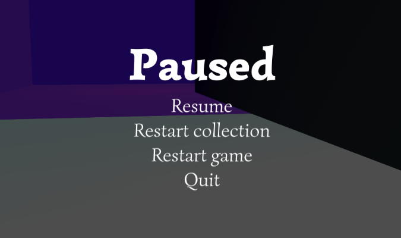

The default pause screen adds a pause screen out-of-the-box. This is to prevent those annoying moments when you create a build, only to forget that you do not have a pause screen, so in order to restart you have to press alt-f4 and open exe again.

Note that only esc is supported and can as such not be opened on anything beyond a keyboard by default. If [InputSystem](https://docs.unity3d.com/Packages/com.unity.inputsystem@1.0/manual/index.html) is installed and enabled then gamepad support is available. Note that PauseSceenUtility.Show() may be called to open it manually.

The default pause screen can be disabled in [scene manager window](SceneManagerWindow#settings).

##### Static methods
> Show()\
Shows the pause screen.

> Hide(bool ignoreAnimations = false)\
Hides the pause screen.

> Toggle()\
Toggles the pause screen.
