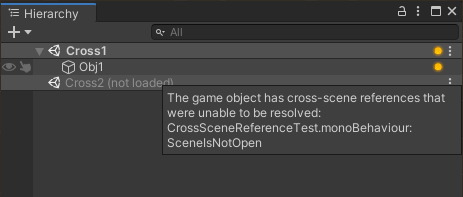

HierarchyGUIUtility is a wrapper around [EditorApplication.hierarchyWindowItemOnGUI](https://docs.unity3d.com/ScriptReference/EditorApplication-hierarchyWindowItemOnGUI.html), which automatically manages the bounds of each registered callback, so that adding a button for example, does not require manual positioning and avoids overlapping other callback rects.

\
Cross scene makes use of HierarchyGUIUtility with its yellow indicator icon, which has a tooltip.

###### Delegates

> bool HierarchySceneGUI(Rect position, Scene scene)\
Called after reserving a rect in hierarchy scene field.\
Return true to indicate that something was drawn, false means that the rect will not be allocated and next OnGUI callback may use the area.

> bool HierarchyGameObjectGUI(Rect position, GameObject gameObject)\
Called after reserving a rect in hierarchy game object field.\
Return true to indicate that something was drawn, false means that the rect will not be allocated and next OnGUI callback may use the area.

###### Methods

> void AddSceneGUI(HierarchySceneGUI onGUI, float? width = null, int? index = null)\
Adds a onGUI call for Scene fields.\
Passing null to width means that width will be the same as height.\
Setting index can help sort icons, when multiple is displayed. Note that order is reversed, higher index means icon will be placed further to the right.

> void AddGameObjectGUI(HierarchyGameObjectGUI onGUI, float? width = null, int? index = null)\
Adds a onGUI call for GameObject fields.\
Passing null to width means that width will be the same as height.\
Setting index can help sort icons, when multiple is displayed. Note that order is reversed, higher index means icon will be placed further to the right.

> void RemoveSceneGUI(HierarchySceneGUI onGUI)\
Remove a OnGUI call for a Scene.

> void RemoveGameObjectGUI(HierarchyGameObjectGUI onGUI)\
Remove a OnGUI call for a GameObject.
