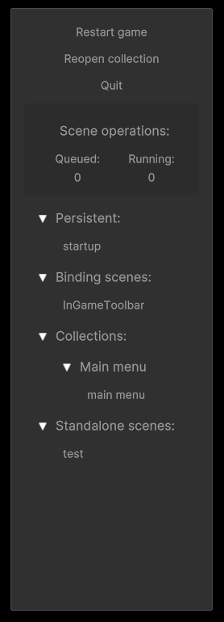

###### In-game toolbar

The in-game toolbar provides some convenient debugging tools for builds.\
While this might not have much use in editor, it may be invaluable when debugging builds.

The in-game toolbar is enabled by default, and can be toggled on or off in the settings tab of the [scene manager window](SceneManagerWindow.md).

###### Header
> Due too unicode not being fully supported in Unity the top row might not be entirely self explanatory, which is only exacerbated by the fact that Unity will not render tooltips during runtime, unless implemented manually.

↻: Reloads the entire game.\
↻ *collection*: Reloads the currently open collection. Does nothing if no collection is open.\
×: Quits the game --*Take note!*

> The following options may reduce performance, please be aware of this when debugging.

> Note that variables on components will, due to performance reasons, not refresh unless node is collapsed and re-expanded.

*Display gameobjects*: Toggles whatever gameobjects should be shown in the list below.\
*Display components*: Toggles whatever components on gameobjects should be shown in the list below.

###### Scene Operations
Displays info about what asm is currently doing.\
The first operation in the queue is the *primary* operation currently running.\
Running operations is usually the *primary* operations and its *sub* operations, such as loading screens, but not necessarily (see [SceneOperation.IgnoreQueue()](SceneOperation.md#methods)).

###### Scene list
The scene list displays the currently open scenes, game objects and components, assuming all display options enabled.

###### Window
The toolbar can be toggled on or off by pressing the expander button on the right side of the game screen, if enabled in settings.\
The toolbar can also be resized horizontally by hovering over the left edge (which will turn white on hover), and dragging.
