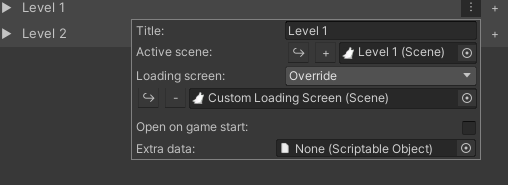

Loading screens can be opened either manually through [LoadingScreenUtility](LoadingScreenUtility) or automatically when opening [collections](SceneCollection).

Two default loading screens are provided out-of-the-box, which can be found in 'AdvancedSceneManager/System/Defaults':
> Fade loading screen\
Fades the screen out and fades in again after operation finished.

> Progress bar loading screen\
Fades in and out like fade, but displays and updates a progress bar.

### Custom loading screens

Custom loading screens can be created by creating a script that inherits from
```csharp
AdvancedSceneManager.Callbacks.LoadingScreen
```

and placing it in a dedicated scene.

### Fields

> [Canvas](https://docs.unity3d.com/Packages/com.unity.ugui@1.0/manual/class-Canvas.html) canvas\
This can be set to automatically register [canvas](https://docs.unity3d.com/Packages/com.unity.ugui@1.0/manual/class-Canvas.html) with [CanvasSortOrderUtility](CanvasSortOrderUtility).

#### Properties

> [ISceneOperation](SceneOperation) operation { get; }\
The associated [scene operation](SceneOperation) that opened this loading screen. May be null if loading screen opened manually.

#### Methods

> abstract IEnumerator OnOpen()\
Called when the associated [scene operation](SceneOperation) is about to start. Use this to show your loading screen.

> abstract IEnumerator OnClose()\
Called when the associated [scene operation](SceneOperation) has ended. Use this to hide your loading screen.

> abstract void OnProgressChanged([ISceneOperation](SceneOperation) progress)\
Called when the associated [scene operation](SceneOperation) has made progress.

> virtual OnScenePhaseChanged([ISceneOperation](SceneOperation) operation, [SceneOperation.Phase](SceneOperation#properties) previousPhase, [SceneOperation.Phase](SceneOperation#properties) nextPhase)\
Called when the associated [scene operation](SceneOperation) changes phase.

> virtual void OnCancel([ISceneOperation](SceneOperation) operation)\
Called when the associated [scene operation](SceneOperation) is cancelled. Note that OnClose([ISceneOperation](SceneOperation)) is not called.


# Guide
Setting up a custom loading screen isn't difficult, but it isn't obvious either, we'll cover how to create a custom loading screen and how to use it in a [collection](SceneCollection) here.

A loading screen in ASM is implemented as a [MonoBehaviour](https://docs.unity3d.com/ScriptReference/MonoBehaviour.html) (through LoadingScreen class) with a few [IEnumerator](https://docs.unity3d.com/Manual/Coroutines.html) callbacks that are called when a [collection](SceneCollection) is opened or closed (or manually opened through [LoadingScreenUtility](LoadingScreenUtility)). Callbacks are waited for, and execution of ASM is stopped until a callback is done, note that OnProgressChanged() is not a callback, it is managed by LoadingScreen.

Each loading scene script is then placed in a dedicated scene, which is then automatically opened by ASM.

##### Code

Create a new script called 'CustomLoadingScreen' and make it inherit from LoadingScreen, you may have to import 'AdvancedSceneManager.Callbacks'.

Remove default methods generated by unity, and override methods required by LoadingScreen.

Now, you may want the loading screen to fade in, rather than just 'pop' in. You can do this easily by adding a [CanvasGroup](https://docs.unity3d.com/Packages/com.unity.ugui@1.0/manual/class-CanvasGroup.html), and using the Fade() extension method provided by ASM.
```csharp
//using AdvancedSceneManager.Utility;

public CanvasGroup group;

public override IEnumerator OnOpen()
{
    yield return group.Fade(1, 1);
}

public override IEnumerator OnClose()
{
    yield return group.Fade(0, 1);
}
```
This will fade the [canvas](https://docs.unity3d.com/Packages/com.unity.ugui@1.0/manual/UICanvas.html) in when loading screen opens and fade out when loading is finished.

Now, for showing progress, add a [Slider](https://docs.unity3d.com/Packages/com.unity.ugui@1.0/manual/script-Slider.html) variable and update it using OnProgressChanged().
```csharp
public Slider slider;

public override void OnProgressChanged(SceneOperation progress)
{
    slider.value = progress.totalProgress;
}
```

This will update a [slider](https://docs.unity3d.com/Packages/com.unity.ugui@1.0/manual/script-Slider.html) when loading progress changes, note that this will probably not be visible when opening smaller scenes since they may load too quickly, so don't worry too much about it for this tutorial, just know that it exists so that you may use it in the future.

Now that we have a functional implementation of a loading screen, we may begin the graphical part.

##### UI

Create a new scene called 'Custom loading screen'.

Add a [canvas](https://docs.unity3d.com/Packages/com.unity.ugui@1.0/manual/UICanvas.html) and a darkish background [image](https://docs.unity3d.com/Packages/com.unity.ugui@1.0/manual/script-Image.html), you may add a bright background instead if you are so inclined. Add a [slider](https://docs.unity3d.com/Packages/com.unity.ugui@1.0/manual/script-Slider.html), which you may style and position as you would like.

Next, add a [CanvasGroup](https://docs.unity3d.com/Packages/com.unity.ugui@1.0/manual/class-CanvasGroup.html) to canvas and then the 'CustomLoadingScreen' script that we created earlier, assign canvas, group, and slider variables.


Setting alpha to 0 in [CanvasGroup](https://docs.unity3d.com/Packages/com.unity.ugui@1.0/manual/class-CanvasGroup.html) may prevent potential flickering.

##### Actually using it

Now for actually using it, we can assign it to a [collection](SceneCollection) in the [Scene Manager Window](SceneManagerWindow), by pressing the  on a collection, and changing 'Loading screen' to 'Override' and assigning the scene to the field that appears directly underneath.



And with that, we're done! You may now open the collection that has the loading screen assigned to it and the screen should start to fade in the ui you created, and when fade is done, the current collection should close and open the new collection, and then fade your ui out.
