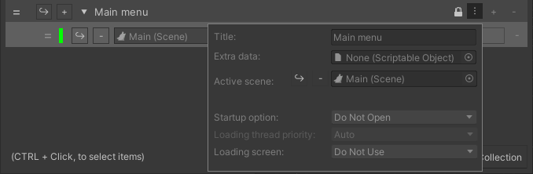
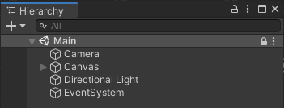
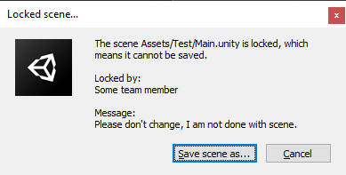

Since ASM 1.3 scenes and collections can now be locked from editing.

> Note we can only prevent edit from inside of unity, any modifications from outside, including source control, cannot be prevented.

 \

  

When scene has been modified and user attempts to save, the following dialog will open, with customizable name and message:

Save as: Opens file dialog to save as new scene.\
Cancel: Discards changes and reloads scene

> Unlocking a collection or scene will display a similar dialog.
