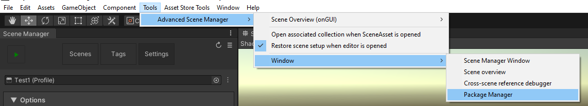
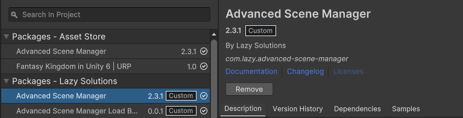

The package manager is responsible for providing an overview over available support packages for ASM and to download and install them.

The package manager will tell you if a package is available for update / install, or up-to-date. If an update available, then a button will be presented to install.

It will also display the current version of ASM, and display a update button if one is available, which will open the unity package manager.

When ASM is updated, the package manager will also attempt to automatically update all previously installed packages to the newest version.

> Note that while releases may be available directly from github.com immediately after release, they may not be available in package manager for up to about 10 minutes, this is likely due to an API restriction.
