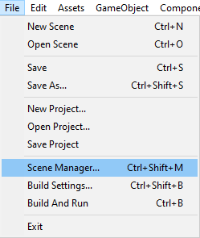
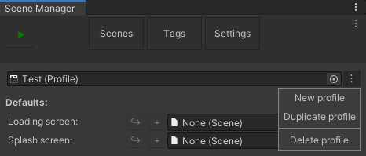
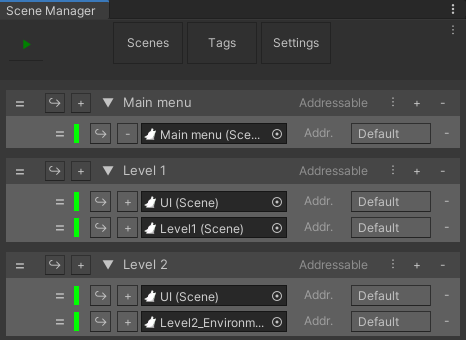
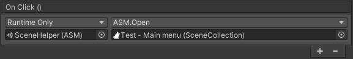
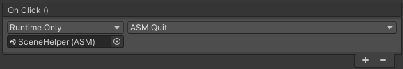

Easily setting up a scene management solution is exactly the issue that ASM is trying to solve, and we've attempted to make it as easy as possible. But there may still be a slight learning curve.

But don't worry, we'll walk through the steps needed to set up a basic scene management solution.

Open up the scene manager window:

### Create profile
First, you'll need a profile. To create one, go to the settings tab. Press the menu button next to the top field. Press '*New profile*' button in the dropdown. Enter your preferred name.

### Setting up collections
Now that we've got a profile, we can go to the scenes tab again to actually set the scenes up. Press the '*New Collection*' button to create a new collection.

Now, press the menu button on its header to open the edit collection menu. The top field is the title of the collection, change it to '*main menu*'.

Next check '*Open on game start*' to automatically open it when game starts. Multiple [collections](SceneCollection) may be set to open at startup, and if so, then they'll be opened in order, top to bottom, this can be useful for [persistent scenes](PersistentUtility), but not something we'll worry about in this guide.

While we won't worry about the other settings right now, they are documented over at [SceneManagerWindow](SceneManagerWindow#collection-properties).

Next, create two more collections, name them '*Level 1*', and '*Level 2*' (don't check '*Open on game start*' this time).

### Adding scenes
Now that we've got our collections setup, we can add scenes to them.

Expand all collections by pressing on their titles, and add a scene by pressing the '*+*' button once on each.

Now create main menu, level 1, and level 2 scenes and assign them to their respective collection. (Just create scenes for now, we'll cover functionality in next segment)

Also create a ui scene.

### Setting up main menu

Now that we have a scene manager solution we can easily open the scenes at runtime.

Now open your main menu scene, by pressing the  button. Setup the scene as you wish, but please add three buttons, one for each level, and one for quit.

Level buttons:\
On the [Button](https://docs.unity3d.com/2018.3/Documentation/ScriptReference/UI.Button.html) component, create a new OnClick action, and assign [SceneHelper](SceneHelper) as target, '*ASM > [Open (SceneCollection)](SceneCollection#methods)*' as method, and assign the collection for the level as parameter.

Quit button:\
On the [Button](https://docs.unity3d.com/2018.3/Documentation/ScriptReference/UI.Button.html) component, create a new OnClick action, and assign [SceneHelper](SceneHelper) as target, '*ASM > [Quit](SceneManager#quit)*' as method.

### Setting up level scenes

Now open ui scene, by pressing the  button. This scene may contain any ui objects, such as a health bar, if you wish, but please add a button to go back to main menu. On this button, create a new OnClick action, assign [SceneHelper](SceneHelper), and select '*ASM > [Restart](SceneManager#restart)*'.

Alternatively you could also set button to open main menu collection directly, the same as level buttons, this would be preferable if any standalone scenes are added, since these would be closed and then opened again, if restart is called.

### And with that, we're done!
Press the play button in the scene manager window, now you'll notice that both level buttons open the associated scene, and the ui scene, with a fade animation, and goes back to main menu with a fade.
