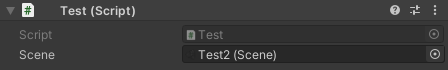
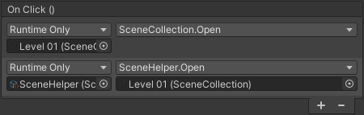

### What is a Scene in Advanced Scene Manager?

An ASM scene is our representation of a [SceneAsset](https://docs.unity3d.com/ScriptReference/SceneAsset.html) Unity scene. All [SceneAssets](https://docs.unity3d.com/ScriptReference/SceneAsset.html) in the project will have a corresponding Scene [ScriptableObject](https://docs.unity3d.com/Manual/class-ScriptableObject.html) generated for it. Aside from the slight confusion that might arise at first, this approach has numerous advantages:

* Drag and drop references in inspector:

  

* [UnityEvent](https://docs.unity3d.com/ScriptReference/Events.UnityEvent.html) support (it might be easier to use [SceneHelper](SceneHelper) as target though, since that will help filter the [object picker](https://docs.unity3d.com/ScriptReference/EditorGUI.ObjectField.html) to only display scenes):

  

* More robust:

  Consider this:

```csharp
  using UnityEngine.SceneManagement;
  using AdvancedSceneManager.Models;

  //------Unity, Out-of-the-box------

  //Path: Loses reference when scene is moved, renamed, deleted...
  //Name: Loses reference when scene renamed, deleted, also
  //      conflicts occur when duplicate names exist...
  public string scene;

  //Loses reference when build index changes...
  public int sceneIndex;

  public void OpenSceneUnity()
  {
      SceneManager.LoadScene(scene);
      SceneManager.LoadScene(sceneIndex);
  }
```
Which could be transformed into this:
```csharp
  //------Advanced Scene Manager------

  //Is automatically updated when its associated SceneAsset is moved,
  //renamed and deleted.
  //Does not rely on build index.
  public Scene scene;

  public void OpenSceneASM()
  {
      scene.Open();
  }

```

## Properties

> isIncluded { get; }\
Returns whatever the scene is currently included in build. This also takes into account whatever a scene is forced to be included, which would be any scenes that have been added to a [collection](SceneCollection), or is set as [splash screen](SceneManagerWindow#settings).

> path { get; }\
The path to the Unity scene in the project.

> assetID { get; }\
The [AssetDatabase](https://docs.unity3d.com/ScriptReference/AssetDatabase.html) id of the SceneAsset.

> tag { get; }\
The [Tag](SceneManagerWindow#tags) of this scene. Tags can be defined on either [profiles](Profile) or [collections](SceneCollection), where collections take priority over profile.   

> isActive { get; }\
Returns whatever this scene is currently the active scene.
Use Activate() to activate a scene.

## Methods

> static [OpenSceneInfo](OpenSceneInfo) Find(string name, SceneCollection inCollection = null, Profile inProfile = null)\
Finds the scene with the specified name.

> static [OpenSceneInfo](OpenSceneInfo)[] FindAll(string name, SceneCollection inCollection = null, Profile inProfile = null)\
Finds the scenes with the specified name.

> [OpenSceneInfo](OpenSceneInfo) GetOpenSceneInfo()\
Finds last opened instance of the specified scene, returns null if no instances exist.

> Open()\
  Opens the scene as [standalone](SceneManager#standalone-scene-manager).

> OpenSingle()\
  Closes all existing scenes and collection, and opens this scene as [standalone](SceneManager#standalone-scene-managerscene).

> Close()\
  Closes the first instance of this scene that is open

> Reopen()\
  Closes the first instance of the scene and then opens it again

> Toggle()\
  Toggles the scene on or off, depending on whatever it is open or not.

> Toggle(bool enabled)\
  Toggles the scene on or off, depending on enabled.

> [SceneAsyncOperation](SceneAsyncOperation)<[PreloadedSceneHelper](PreloadedSceneHelper)> Preload()\
  Preloads the scene, which loads it into memory but does not display it.

<a class="pdf-page-break"></a>

> Activate()\
  Sets the scene as the active scene in the hierarchy.

> IsOpenReturnValue IsOpen()\
  Returns whatever this scene is open.

> ([SceneCollection](SceneCollection)collection, bool asLoadingScreen)[] FindCollections()\
  Finds the [collections](SceneCollection) that this scene is associated with.

> [SceneTag](SceneManagerWindow#tags) FindTag([SceneCollection](SceneCollection) collection = null)\
Finds the tag for this scene on either the specified [collection](SceneCollection), or on the [active profile](Profile). If collection is null, then [SceneManager.collection.current]() will be used instead.

> [SceneTag](SceneManagerWindow#tags) GetTagFromCollection([SceneCollection](SceneCollection) collection = null)\
Finds the [tag](SceneManagerWindow#tags) for this scene on the specified [collection](SceneCollection).
If [collection](SceneCollection) is null, then [SceneManager.collection.current](SceneManager#collection-scene-manager) will be used instead.

> [SceneTag](SceneManagerWindow#tags) GetTagFromProfile()\
Finds the [tag](SceneManagerWindow#tags) for this scene on the active [profile](Profile).

The following methods can take a sceneIndex parameter which can be used to distinguish scenes that have been opened multiple times, (i.e. if first instance of the scenes is at the top of the hierarchy and the second is at the bottom, use sceneIndex: 1 for the second instance).

> T FindObject<T>(int sceneIndex = 0)\
Finds the component of type T in the scene object hierarchy.

> IEnumerable\<T> FindObjects<T>(sceneIndex = 0)\
Finds the components of type T in the scene object hierarchy.

> [GameObject](https://docs.unity3d.com/ScriptReference/GameObject.html)[] GetRootGameObjects(int sceneIndex = 0)\
Gets the root game objects of this scene.
