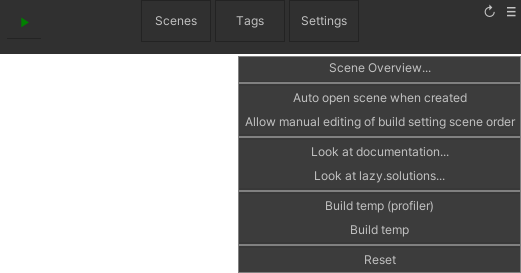
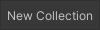
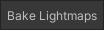
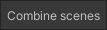
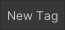
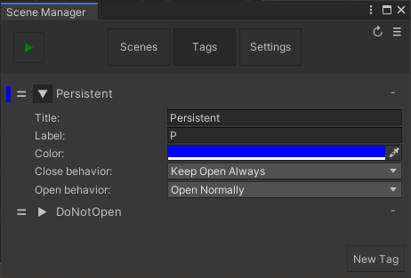
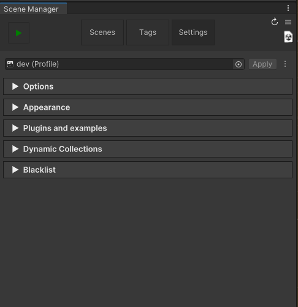

The Scene Manager Window can be used to manage the [SceneCollections](SceneCollection) (commonly referred to as collection) and scenes in a project, and also the behavior of Advanced Scene Manager.

The scene manager window can be opened through:\

## Header

 button enters play mode and starts startup sequence as if a build was started.

####  button
> Scene Overview...\
Opens [Scene Overview Window](SceneOverviewWindow).

> Auto open scene when created\
When a scene is created from a scene row in a collection, should we open it afterwards?

> Allow manual editing of build settings scene order\
Build order is managed by ASM and might cause issues if manual editing is turned on, but there might be certain circumstances where it is needed.

> Look at documentation...\
Open github wiki (this is where you are right now!)

> Look at lazy.solutions...\
Open our company webpage.

> Build temp (profiler)\
Builds and runs the project, also attaches profiler.

> Build temp\
Builds and runs the project.

> Reset\
Resets Advanced Scene Manager by deleting [profiles](Profile), [collections](SceneCollection), and [ASM Scenes](Scene) (which will be immediately generated again after).

### The Scene Manager Window has three tabs:
### [Scenes](#scenes) | [Tags](#tags) | [Settings](#settings)

#### Scenes
The Scenes tab is where the [collections](SceneCollection) of scenes are set up.

##### Create new collection
Press  button to create a new [collection](SceneCollection).

##### Collection properties
To edit properties of a collection, press the  button on the header to open the collection menu. In the collection menu the following properties can be changed:

> Title\
The title of this collection.

> Extra data:\
A scriptable object that is to be associated with this collection, retrievable in code by SceneCollection.ExtraData<T>() or SceneCollection.extraData.

> Active scene\
The scene that should be activated after collection has been opened.

> Startup option\
Can be one of the following values:\
Do not open: Don't open this collection during startup. (default)\
Open: Open this collection during startup.\
Open as persistent: Open this collection during startup, and flag each scene within as [persistent](PersistentUtility) (aka [SceneCloseBehavior.KeepOpenAlways](#Tags)).

> Loading thread priority:\
Automatically set [Application.LoadingThreadPriority](https://docs.unity3d.com/ScriptReference/Application-backgroundLoadingPriority.html) to specified value when this collection is opened (and is reset when done).\
This field will be disabled if 'Background Loading Priority' is disabled in settings tab.

> Loading Screen\
The loading screen to use when opening or closing this collection.

##### Add or remove scenes / collection
Scenes can be added to a [collection](SceneCollection) by pressing the  button on its header, [Scenes](Scene) and [SceneAsset](https://docs.unity3d.com/ScriptReference/SceneAsset.html) can then be dragged onto the scene fields.

The  button on a collection header or scene row can be used to remove a collection or scene.

##### Reorder
Hold and drag on  button and drag up and down to reorder collections or scenes.

##### Open buttons
> Tip: Holding shift when using any of the following buttons, will force open any scenes tagged with SceneOpenBehavior.DoNotOpenWithCollection.

 button can be used to open a collection in play mode.

 button can be used to open a collection or scene, closing all other scenes.

 and  buttons can be used to open or close collections or scenes additively. Collections can only be opened additively in editor, outside of play mode.

#### Selection, bake lightmaps, combine scenes

[Scenes](Scene) and [collections](SceneCollection) can be selected by holding ctrl and clicking on it in the scenes tab.

When more than one scene are selected (collections count for all its containing scenes), the  button will appear, this will allow you to bake lightmaps for all the selected [scenes](Scene), and when a [collection](SceneCollection)  is selected, all [scenes](Scene) within  will be included.

When more than one scene are selected (collections do not count), the  button will appear, this will allow you to quickly [merge scenes together](SceneMergeSplit), note that this cannot be undone, except for using the [split scene utility](SceneMergeSplit).

#### Tags
Tags can be used to specify custom open or close behavior, when opened or closed through a collection.

Press  button to create a new tag.

> Title\
The title of the tag.

> Label\
Can be used to show a label to quickly identify scenes with this tag in the scenes tab.

> Color\
Can be used to show a strip of color to quickly identify scenes with this tag in the scenes tab.

> Close behavior:
- Close
  - (default) Closes scene like normal.
- Keep open if next collection also contains scene
  - Keeps the scene open when opening a collection that also contains the scene, otherwise close.
- Keep open always
  - Persistent, ASM will never close automatically.

> Open behavior:
  - (default) Open normally
    - Open like normal
  - Do not open in collection
    - Do not open this scene automatically when the associated collection is opened

  

#### Settings
The settings tab can be used change behavior of advanced scene manager.

> [Profile](Profile):\
The active [Profile](Profile) in ASM.

###### Options

> [Splash screen](SplashScreen):\
The custom [splash screen](SplashScreen) to display during startup, plays after Unity's splash screens, if enabled. Provides more flexibility than Unity's splash screen since ours are merely implemented as scenes with a script using IEnumerator callback.

> [Startup loading screen](LoadingScreenUtility):\
The [loading screen](LoadingScreenUtility) that will be used during startup.

> [Loading screen](LoadingScreenUtility):\
The [loading screen](LoadingScreenUtility) that will be used for [collections](SceneCollection) that are set to use the default loading screen.

> Background loading priority:\
If enabled, automatically set [Application.backgroundLoadingPriority](https://docs.unity3d.com/ScriptReference/Application-backgroundLoadingPriority.html) during startup.\
Note that collections can also specify loading priority during open, but that is only temporary, and value will be reset back to this when done.\
Disable this if you are using another asset which relies on managing this setting by itself.

> Create camera for [splash screens](SplashScreen):\
Automatically create camera for [splash screens](SplashScreen), if no main camera is found.

> Use [default pause screen](DefaultPauseScreen):\
ASM has a [default pause screen](DefaultPauseScreen) for those times when you build and then forget that no one has created a pause screen yet, forcing you to alt-f4, then restart again. This toggles default pause screen on or off.

> Enable [cross-scene references](CrossSceneReferences):\
Enables or disables [cross-scene references](CrossSceneReferences).

###### Appearance

The following properties are only visible if the corresponding package is installed from the [package manager](PackageManager), if none are installed then this entire section will be hidden.

These properties are also local to the computer / user, so feel free to modify these to your personal preference.

> Display unresolved cross scene reference icon: \

> Display lock buttons: \

> Display addressable buttons: \

> Options for toggling visiblility for the following also available:\
Collection play button\
Collection open button\
Collection open additive button\
Persistent scene indicator

###### Log

> Pointless opening of [collections](SceneCollection) during startup:\
Enables or disables warnings during startup that a [collection](SceneCollection) was opened, then closed because another [collection](SceneCollection) was also set to open during startup, and no [scene](Scene) within was persistent.

> Pointless opening of scenes during startup:\
Enables or disables warnings during startup that a [scene](Scene) was opened, then closed when a [collection](SceneCollection) was opened because [scene](Scene) was not persistent.

  

> Deleting temp Build:\
Enables or disables a message that indicates that the temp build was deleted after process ended, this is mostly just useful for debugging when issues cause folder to not be deleted and is a quick way to know if this feature works as intended or not.

> Unresolved [cross-scene reference](CrossSceneReferences):\
Enables or disables warnings when a [cross-scene reference](CrossSceneReferences) could not be resolved when a [scene](Scene) was opened or closed.
