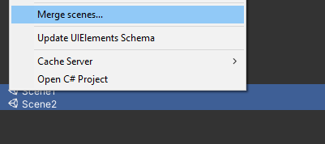
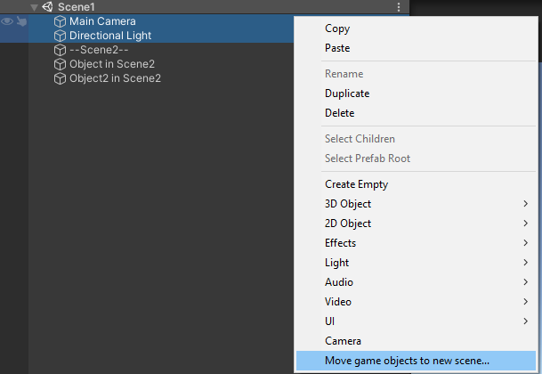
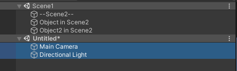

## Scene merge

Merging scenes can be done in two ways:\
(API methods are contained in [SceneUtility](SceneUtility))

Pressing the  button:

Or by selecting two or more SceneAsset in project window:

The scenes will then be merged like this:

## Scene split
Scenes can be split by selecting two GameObjects in the hierarchy:

And will be split like this:

