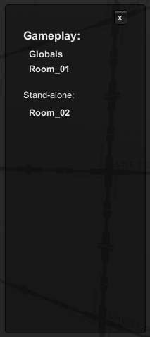
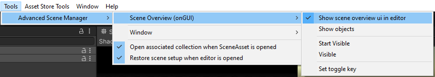

The scene overview ui helps to get an overview over the currently open scenes.\
While this might not have much use in editor, it may be invaluable when debugging build in certain circumstances.

The scene overview ui can be enabled through the menus:

or through the toggle key, which by default is set to F6 (though there is some weird issue with different unity installations / PCs that cause default key not to work, in this case you may have to change it manually first).

Toggle key can be changed using 'Set toggle key'.

Note that 'Show objects' may be slow, please be aware of this when debugging.
