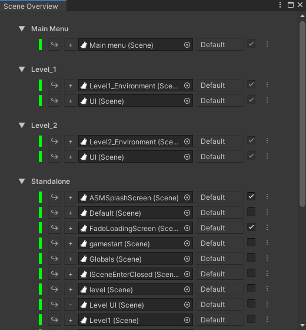

The scene overview window provides an easy overview over all [scenes](Scene) in the project,
grouped by what [collection](SceneCollection)(s) they are a part of. All [scenes](Scene) that are not part of
a collection appear under the standalone group.

 

From here you can:
> Open [scene](Scene) as either single (close all open [scenes](Scene) beforehand) or as additive.

> Change [tag](SceneManagerWindow#tags) for a [scene](Scene) in the current [profile](Profile).

> Set whatever a [scene](Scene) should be included in build. [Scenes](Scene) that are part of a
[collection](SceneCollection) will always be included, but standalone [scene](Scene) needs to explicitly
be included here or through unity's [build settings window](https://docs.unity3d.com/Manual/BuildSettings.html).

> Set [scene](Scene) as persistent in editor. This means that when a [scene](Scene) is opened in
the editor, this [scene](Scene) can be automatically opened as well. For runtime,
[PersistentUtility](PersistentUtility) can be used.

 

