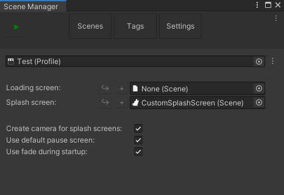

## Splash screen
A splash screen in ASM is implemented as a script inheriting
```csharp
AdvancedSceneManager.Callbacks.SplashScreen
```
and placing it in a dedicated scene, and assigning it in the ASM [settings](SceneManagerWindow#settings).

One splash is provided out-of-the-box, which, while functional, is just intended as a reference, and can be found in 'AdvancedSceneManager/System/Defaults'.

> ASM Splash Screen\
Displays the text 'Advanced Scene Manager', with fade animations.

### Fields

> [Canvas](https://docs.unity3d.com/Packages/com.unity.ugui@1.0/manual/class-Canvas.html) canvas\
This can be set to automatically register [canvas](https://docs.unity3d.com/Packages/com.unity.ugui@1.0/manual/class-Canvas.html) with [CanvasSortOrderUtility](CanvasSortOrderUtility).

#### Properties

> [SceneOperation](SceneOperation) progress { get; }\
Inherited from [LoadingScreen](LoadingScreen), will always be null.

#### Methods

> abstract IEnumerator DisplaySplashScreen()\
Called during [startup process](SceneManager#runtime) when the scene manager is ready to display the splash screen.

## Guide
Splash screens in ASM are implemented as [MonoBehaviour](https://docs.unity3d.com/ScriptReference/MonoBehaviour.html) (through SplashScreen class) with a callback that manages everything that should happen during the splash screen. Callback is waited for, and execution of ASM is stopped until callback done.

This means that, in difference from Unity's own splash screens, you may do whatever you want during the splash screen, such as play video and/or download extra data from the internet or just load assets, like an initial loading screen.

##### Code

Create a script called 'CustomSplashScreen' and make it inherit from SplashScreen, you may have to import 'AdvancedSceneManager.Callbacks'.

Remove default methods generated by unity, and override DisplaySplashScreen().

In this guide we'll create a splash screen that fades in some text, then out, to do this we can create add public [CanvasGroup](https://docs.unity3d.com/Packages/com.unity.ugui@1.0/manual/class-CanvasGroup.html) variable, and use the extension method Fade() provided by ASM. In between fade in and out, add a delay.

```csharp
//using AdvancedSceneManager.Utility;
public CanvasGroup group;

public override IEnumerator DisplaySplashScreen()
{
    yield return group.Fade(1, 1);
    yield return new WaitForSecondsRealtime(4);
    yield return group.Fade(0, 1);
}
```

This will fade the splash screen in, wait for 4 seconds, and then fade out again, and then ASM will continue with [startup](SceneManager#runtime).

##### UI

Create a new scene called 'CustomSplashScreen'. Add a [Canvas](https://docs.unity3d.com/Packages/com.unity.ugui@1.0/manual/UICanvas.html), a black background image to cover whats behind ui, then a [CanvasGroup](https://docs.unity3d.com/Packages/com.unity.ugui@1.0/manual/class-CanvasGroup.html) on a child object to background, set alpha on [CanvasGroup](https://docs.unity3d.com/Packages/com.unity.ugui@1.0/manual/class-CanvasGroup.html) to 0 to prevent potential flickering. Add some [text](https://docs.unity3d.com/Packages/com.unity.ugui@1.0/manual/script-Text.html) in the center, with whatever you want, perhaps developer or publisher name?

Now add the 'CustomSplashScreen' script we created earlier to the [canvas](https://docs.unity3d.com/Packages/com.unity.ugui@1.0/manual/UICanvas.html), then assign canvas and group.

##### Actually using it
Making ASM actually use it is as simple as assigning it in the [settings](SceneManagerWindow#settings) tab in [Scene Manager Window](SceneManagerWindow).



And with this, we're done! You may now use the  in [Scene Manager Window](SceneManagerWindow) to start game as if it was a build, since splash screen won't play otherwise, and you should see the text fade in, wait for a few seconds, and then fade out again, and then ASM will continue [startup](SceneManager#runtime) process, and open your [collections](SceneCollection) and [scenes](Scene).
