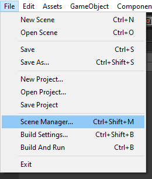
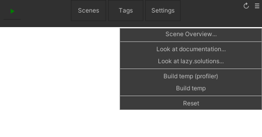
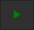
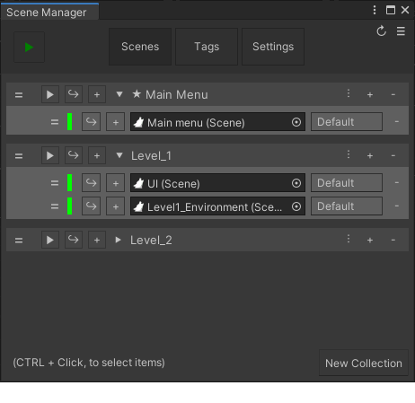
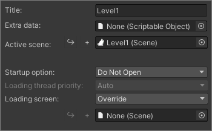
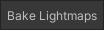
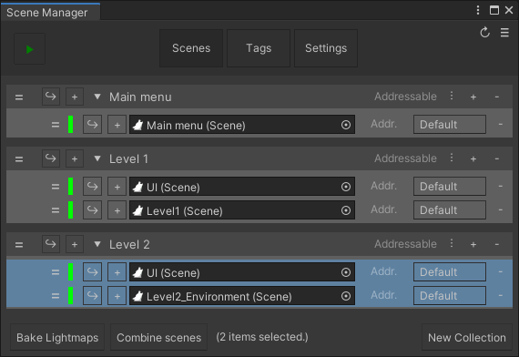
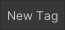
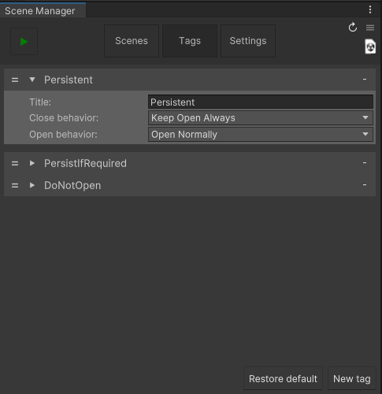
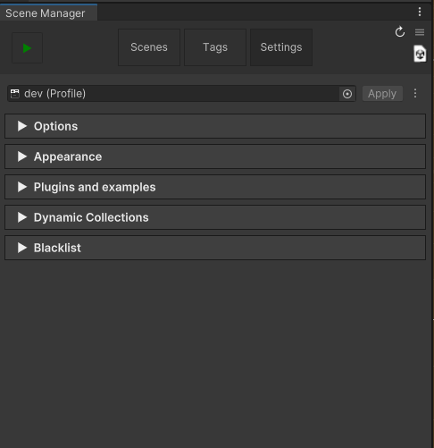

## Scene manager window

 

The Scene Manager Window can be used to manage the [SceneCollections](SceneCollection.md) (commonly referred to as collection) and scenes in a project, and also the behavior of Advanced Scene Manager.

The scene manager window can be opened through: 

## Header

 button enters play mode and starts startup sequence as if a build was started.

###  button

> Scene Overview... 
Opens [Scene Overview Window](SceneOverviewWindow.md).

 
> Look at documentation... 
Open github wiki

 
> Look at lazy.solutions... 
Open our company webpage.

 
> Build temp (profiler) 
Builds and runs the project, also attaches profiler.

 
> Build temp 
Builds and runs the project.

 
> Reset 
Resets Advanced Scene Manager by deleting [profiles](Profile.md), [collections](SceneCollection.md), and [ASM Scenes](Scene.md) (which will be immediately generated again after).

## The Scene Manager Window has three tabs:
### [Scenes](#scenes) | [Tags](#tags) | [Settings](#settings)

## Scenes
The Scenes tab is where the [collections](SceneCollection.md) of scenes are set up.

### Create new collection
Press  button to create a new [collection](SceneCollection.md).

### Collection properties
To edit properties of a collection, press the  button on the header to open the collection menu. In the collection menu the following properties can be changed:

> Title 
The title of this collection.

 
> Extra data: 
A scriptable object that is to be associated with this collection, retrievable in code by SceneCollection.ExtraData<T>() or SceneCollection.extraData.

 
> Active scene 
The scene that should be activated after collection has been opened.

 
> Startup option 
Can be one of the following values: 
 Auto: Open if this collection is the uppermost collection in the list that is enabled. (default) 
 Do not open: Don't open this collection during startup. 
 Open: Open this collection during startup. 
 Open as persistent: Open this collection during startup, and flag each scene within as [persistent](../api/AdvancedSceneManager.Utility.PersistentUtility.html) (aka [SceneCloseBehavior.KeepOpenAlways](#tags)).

 
> Loading thread priority: 
Automatically set [Application.LoadingThreadPriority](https://docs.unity3d.com/ScriptReference/Application-backgroundLoadingPriority.html) to specified value when this collection is opened (and is reset when done). 
This field will be disabled if 'Background Loading Priority' is disabled in settings tab.

 
> Loading Screen 
The loading screen to use when opening or closing this collection.

### Add or remove scenes / collection
Scenes can be added to a [collection](SceneCollection.md) by pressing the  button on its header, [Scenes](Scene.md) and [SceneAsset](https://docs.unity3d.com/ScriptReference/SceneAsset.html) can then be dragged onto the scene fields.

The  button on a collection header or scene row can be used to remove a collection or scene.

### Reorder
Hold and drag on  button and drag up and down to reorder collections or scenes.

### Open buttons
> Tip: Holding shift when using any of the following buttons, will force open any scenes tagged with SceneOpenBehavior.DoNotOpenWithCollection.

 button can be used to open a collection in play mode.

 button can be used to open a collection or scene, closing all other scenes.

 and  buttons can be used to open or close collections or scenes additively. Collections can only be opened additively in editor, outside of play mode.

### Selection, bake lightmaps, combine scenes

[Scenes](Scene.md) and [collections](SceneCollection.md) can be selected by holding ctrl and clicking on it in the scenes tab.

When more than one scene are selected (collections count for all its containing scenes), the  button will appear, this will allow you to bake lightmaps for all the selected [scenes](Scene.md), and when a [collection](SceneCollection.md)  is selected, all [scenes](Scene.md) within  will be included.

When more than one scene are selected (collections do not count), the  button will appear, this will allow you to quickly [merge scenes together](Scene.md#scene-merge), note that this cannot be undone, except for using the [split scene utility](Scene.md#scene-split).

## Tags
Tags can be used to specify custom open or close behavior, when opened or closed through a collection.

Press  button to create a new tag.

> Title 
The title of the tag.

 
> Close behavior:
- Close
  - (default) Closes scene like normal.
- Keep open if next collection also contains scene
  - Keeps the scene open when opening a collection that also contains the scene, otherwise close.
- Keep open always
  - Persistent, ASM will never close automatically.

 
> Open behavior:
  - (default) Open normally
    - Open like normal
  - Do not open in collection
    - Do not open this scene automatically when the associated collection is opened

## Settings
The settings tab can be used change behavior of advanced scene manager.

> [Profile](Profile.md): 
The active [Profile](Profile.md) in ASM.

### Options

> [Splash screen](SplashScreen.md): 
The custom [splash screen](SplashScreen.md) to display during startup, plays after Unity's splash screens, if enabled. Provides more flexibility than Unity's splash screen since ours is merely implemented as scenes with a script using IEnumerator callback.

 
> [Startup loading screen](LoadingScreen.md): 
The [loading screen](LoadingScreen.md) that will be used during startup.

 
> [Loading screen](LoadingScreen.md): 
The [loading screen](LoadingScreen.md) that will be used for [collections](SceneCollection.md) that are set to use the default loading screen.

 
> Startup scene: 
 This is the scene that should open first in build. Don't change this unless you know what you're doing.

 
> Background loading priority: 
If enabled, automatically set [Application.backgroundLoadingPriority](https://docs.unity3d.com/ScriptReference/Application-backgroundLoadingPriority.html) during startup. 
Note that collections can also specify loading priority during open, but that is only temporary, and value will be reset back to this when done. 
Disable this if you are using another asset which relies on managing this setting by itself.

 
> Create camera during startup: 
Automatically create camera during startup, if no main camera is found.

 
> Use [default pause screen](PauseScreenUtility.md): 
ASM has a [default pause screen](PauseScreenUtility.md) for those times when you build and then forget that no one has created a pause screen yet, forcing you to alt-f4, then restart again. This toggles default pause screen on or off.

 
> Include fade loading screen: 
 Includes the default fade loading screen in build.

### Local

> Open collection when SceneAsset opened: 
 Attempts to find and open an associated collection when a SceneAsset is opened in editor.

 
 > Open scenes when created using scene field: 
When creating scenes using 'New' button in collections, should we open the scene afterwards?

 
 > Allow manual editing of build settings: 
 Allows editing build settings, note that this might make things weird in build, so please make sure to test everything properly when using this.

 
 > Use save dialog when creating scenes: 
 There are two ways to create scenes (when using 'New' button in collections): 
 Checking this make ASM use the first option. 
    - Opening save file dialog. 
    - Using project window, which puts scene in current folder and prompts for name. 

 
 > Save action when using ASM play button: 
 When any open scene has changes what should we do?: 
     - Do Nothing 
     - Save: Save without prompting 
     - Prompt: Prompt using regular dialog, if user presses no, changes will be discarded.

### Log

> Pointless opening of [collections](SceneCollection.md) during startup: 
Enables or disables warnings during startup that a [collection](SceneCollection.md) was opened, then closed because another [collection](SceneCollection.md) was also set to open during startup, and no [scene](Scene.md) within was persistent.

 
> Deleting temp Build: 
Enables or disables a message that indicates that the temp build was deleted after process ended, this is mostly just useful for debugging when issues cause folder to not be deleted and is a quick way to know if this feature works as intended or not.

### In-game toolbar

 > Display ingame toolbar: 
 Determines whatever the in-game toolbar should be enabled upon entering play mode, or build.

 
 > Display in editor: 
 Should it be enabled in editor?

 
 > Expanded by default: 
 Should the in-game toolbar is start as expanded?

### Appearance

These properties are local to the computer / user, so feel free to modify these to your personal preference.

 ### Hierarchy

 > Display collection titles on scenes in heirarchy: 
 If enabled, we'll display the title of the collection a scene belongs to in the heirarchy.

 
 > Display 'persistent' on scenes in heirarchy: 
  If enabled, we'll display 'persistent' indicator on scenes that are persistent in the heirarchy.

 ### Scenes tab

 > Show extra add collection menu: 
  If enabled, we'll display a button next to the regular add collection button, which presents some more options.

 
 > Display dynamic collections: 
  If enabled, we'll display the dynamic collections of the current profile.

 ### Window header

 > Show scene helper drag button: 
  If enabled, we'll display a button in the upper right corner, next to menu button, that allows you to start a drag drop with the scene helper.

 ### Collection header

 > Display collection play button: 
  If enabled, we'll display the play button on collections.

 
 > Display collection open button: 
  If enabled, we'll display the open button on collections.

 
 > Display collection open additive button: 
  If enabled, we'll display the open additive button on collections.

 
 > Display include in build toggle on collections: 
  If enabled, we'll display a toggle which determines whatever a collection should be included in build.

### Plugins and samples
The package manager can be used to install plugins for ASM. It also contains links to samples on github.

The following plugins are currently available: 
[plugin.asm.locking](https://github.com/Lazy-Solutions/plugin.asm.locking) 
[plugin.asm.addressables](https://github.com/Lazy-Solutions/plugin.asm.addressables)

Experimental: 
[plugin.asm.cross-scene-references](https://github.com/Lazy-Solutions/plugin.asm.cross-scene-references)

### Dynamic collections
 Dynamic collections allow you to automatically include all scenes in a folder (including subfolders) in build. 
 Dynamic collections override blacklisted scenes.

 

### Blacklist
Blacklist allows you to make ASM ignore scenes that are irrelevant.

  
