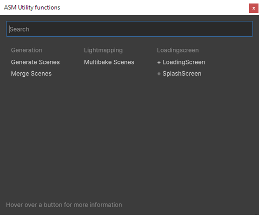
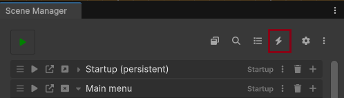

## ASMUtilityFunction

ASMUtilityFunction provides quick, easily accessible utility functions within the Advanced Scene Manager (ASM). These functions are designed to be flexible and extendable, allowing users to create custom utilities that integrates with ASM.

### Extending ASMUtilityFunction

To add a custom utility function, create a new class that inherits from ASMUtilityFunction. Override the necessary properties and methods to define the utility’s name, description, grouping, and functionality. ASM will automatically find and display them in the list. 

Here’s a basic example:

```csharp
public class CustomUtilityFunction : ASMUtilityFunction
{
    public override string Name => "My Custom Utility";
    public override string Description => "A description of what this utility does.";
    public override string Group => "Custom Group";

    public override void OnInvoke(ref VisualElement optionsGUI)
    {
        VisualElement visualElement = new();

        Button button = new Button(() => { 
            // Define the button's functionality here
        });

        visualElement.Add(button); 

        optionsGUI = visualElement;
    }
}
```
