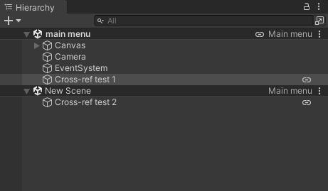
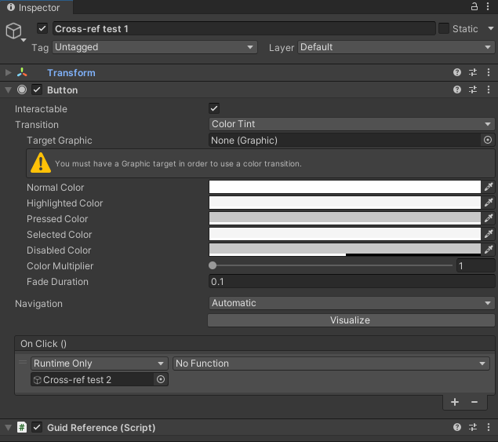
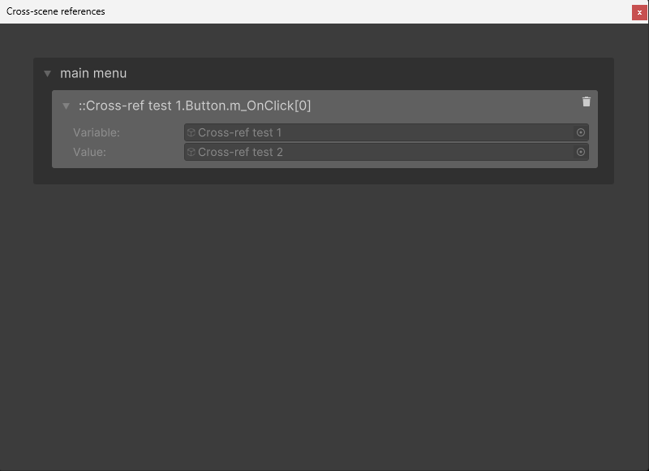
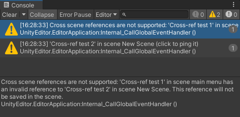

# Cross-scene references

Cross scene references is one of those small things that should be supported by Unity, but just isn't. ASM implements this feature and may be enabled in [settings](Scene%20manager%20window.md#scene-loading-page).

> Note that due to the nature of working around Unity's attempts to prevent cross-scene references, and certain usage non-public APIs (*Unity event support*), it is hacky at best, so please test your games thoroughly if you decide to use them.

A Guid Reference script will be automatically added to both objects, this is what makes the entire thing work. You may use these on your own if you wish, have a look at [GuidReferenceUtility](../api/Utility.GuidReferenceUtility.md).

When an object has a reference to another scene, a link icon will be displayed next to both objects in the hierarchy, pressing the link icon will select the connected object.

Pressing the link on the scene field will open the cross-scene reference debugger, 
which will list all references stored in ASM, and will hopefully help in figuring out if and why a reference is broken. You may also delete references from here, doing so will set the Variable field to null.

Note that you may receive warnings from unity, these are safe to ignore. We have tried our best to hide as many these warnings as possible, but Unity will not relent.

## Start, Awake, OnEnable

Due to the way scenes are loaded in unity, ASM cannot restore cross-scene references until after the scene is fully loaded, `Start()`, `Awake()`, and `OnEnable()` are called before the first possible time to restore them.

You may however make use of [ASM scene callbacks](Callbacks.md), cross-scene references are guaranteed to have been restored by the time they are called.

