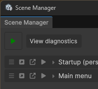

# Discoverables

Discoverables is a centralized system for **attribute callbacks**.

An attribute callback is a pattern where a method or class is automatically invoked or registered when a certain attribute is present. You may already be familiar with this concept through Unity’s built-in mechanisms. For example:

```csharp
[InitializeOnLoad]
static void OnLoad() {}
```

The discoverability system builds upon this concept, providing a unified and optimized way to register, locate, and execute such callbacks across the editor and runtime.

This centralized system allows ASM to not only optimize the discovery process, but also cache the found callbacks. The goal is twofold:

**Performance in the Editor and Efficiency in Builds**  
Instead of repeatedly using reflection to find attributes, ASM performs one comprehensive scan and stores the results for quick access. This approach ensures faster startup and smoother workflows during development. In builds, the same cached data is persisted, meaning no scanning is needed at runtime. The system can simply read from this cache to restore discoverables instantly, providing the same flexibility but with virtually zero overhead in builds.

---

### Example

```csharp
[OnLoad]
static void OnLoad() => Debug.Log("ASM has finished initializing");
```

In the example above, ASM’s discoverability system automatically detects and caches the method. Once ASM completes its initialization, it automatically invokes the method, effectively mirroring the behavior of calling `SceneManager.OnInitialized(Action)` directly, but without requiring any manual setup.

---

You can view all registered discoverables in the **Diagnostics** popup of the ASM window, accessed via the **Diag** button beside the **ASM Play** button. *Note that the button might not be visible, as it is transparent and only shows text when ASM is performing operations like opening or closing scenes.*



### Supported Discoverables

Below is a summary of the discoverable attributes currently supported by ASM:

| Attribute                             | Description                                                                                                                                                                                                                                                                                                          |
| ------------------------------------- | -------------------------------------------------------------------------------------------------------------------------------------------------------------------------------------------------------------------------------------------------------------------------------------------------------------------- |
| **[OnLoad]**                          | Invoked after ASM finishes initializing (following a domain reload), before the ASM startup process begins. It’s called regardless of whether the startup process runs in the current context. Callback is effectively mirroring `SceneManager.OnInitialized(Action)`. It works in *both* **editor** and **builds**. |
| **[ASMWindowElement]**                | Invoked to display a custom element within the ASM window. Inserts the VisualElement return value. *(also supports application on a class inheriting from ViewModel, for more advances use cases)*                                                                                                                   |
| **[AutoSceneHandler]**                | Used with the Auto Scene system. Invoked when a scene has an auto scene specified that uses the custom option the callback handles.                                                                                                                                                                                  |
| **[DiscoverabilityCacheInvalidated]** | Triggered when ASM’s discoverability cache is rebuilt for an assembly. If multiple assemblies are invalidated together, this callback may only be invoked once.                                                                                                                                                      |

The following discoverables are are not yet available, but will be in 3.1:

| Attribute             | Description                                                                                                                                                                                                                                  |
| --------------------- | -------------------------------------------------------------------------------------------------------------------------------------------------------------------------------------------------------------------------------------------- |
| **[RegisterService]** | Used with the DI system. Registers a service and can be applied to either the implementation or interface. This allows ASM to automatically discover and initialize services at startup.                                                     |
| **[Inject]**          | Used with the DI system to specify fields or properties that ASM should automatically populate. This attribute can be applied within `ViewModel`, `ServiceBase`, or `MonoBehaviour` classes, making dependency setup seamless and automated. |