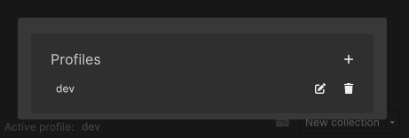

## Profiles

Profiles in ASM are used to define and switch between distinct scene configurations. Each profile includes:

- Scene Collections
- Dynamic Collections
- Standalone Scenes
- Default Loading Screen
- Splash Screen
- Configuration settings from the settings popup
- Unity build profile. *More info below*.

Profiles are activated in the bottom-left corner of the Scene Manager window, via the profile picker.

---

### Default Profile

The **default profile** is activated automatically as a fallback when user does not have an active profile saved when ASM is initializing. This setting is configured in the Editor settings.

---

### Forced Profile

The **forced profile** option (also set in Editor settings) overrides the per-user setting and enforces a shared profile across the team.

This is ideal for teams where one person manages ASM.

---

### Unity Build Profile

ASM optionally supports associating a ASM profile with a Unity [Build Profile](https://docs.unity3d.com/Manual/BuildSettings.html). When assigned ASM will write build scene list to it, assuming ASM hasn't been configured not to. This is configurable in the Editor settings.

**There are a few quirks to be aware of though:**

By default, ASM writes to Unity’s **global build scene list** (`EditorBuildSettings.scenes`).

However, if a **Unity Build Profile** is active, Unity redirects all build scene writes to that profile instead.

This means:
- If the active ASM profile has **no Unity build profile assigned**, and
- Unity has a **Build Profile active**,
Then **ASM would write to that active Unity build profile**, not the global scene list.

To avoid this unintended behavior, ASM disables automatic build scene list writing when:
- A Unity Build Profile is active, **and**
- The current ASM profile has **no associated Unity Build Profile**.

A warning will be logged in console when this happens. This behavior can be changed in the Editor settings.