# Quick start

 

**Install ASM from Package Manager:**

To begin, open Unity and navigate to the Window menu. From there, open the package manager and search for Advanced Scene Manager", install it. Wait for unity to compile.

**Open Scene Manager Window:** 

Access the Scene Manager window through the File menu and choose "Scene Manager..."

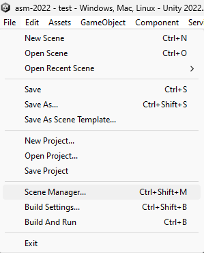

**Create Profile:** 

Within the Scene Manager window, press the profile selector, in the lower left corner. Create a new profile by clicking on the current profile name or "create", if none exists, or "none", if profiles do exist, but none are selected.

**Default profile:** 

The default profile has two collections "Startup (persistent)" and "Main Menu". Press the menu button on the collection headers, and observe that both collections are set to open at startup. On Startup collection, also observe the "Open persistent" toggle in the "Open options" further down.

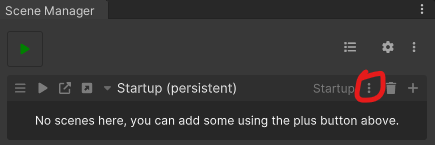

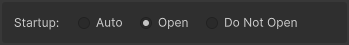

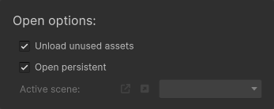

**Create Scenes:** 

Create two scenes like you normally would in unity, name them "Startup" and "Main Menu".

**Import Scenes into ASM:** 

Following scene creation, a notification will appear in the Scene Manager window. Click on the notification to open the import popup. Confirm that both scenes are toggled and press "Import".

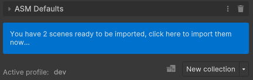

**Assign Scenes to Collections:** 

Within the Scene Manager, drag the scenes into their respective collections and drop them on the "drop area" to add them.

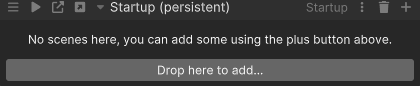

**Press Play in Scene Manager:** 

Located at the top left of the Scene Manager window, press the Play button. Watch as ASM enters play mode and plays the default ASM splash screen, then fades out, opens scenes, fades in, the main menu scene should be active in hierarchy.

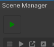

**Levels**

Now, lets create some levels, create two collections, "Level 1" and "Level 2". This time, instead of creating scenes in project window, lets add a scene field in each collection, by pressing the "+" in the collection header. Then press the create scene button to the right of the object field. Name the scenes the same as their collections. Lets also create a UI scene, and assign it to both level collections.

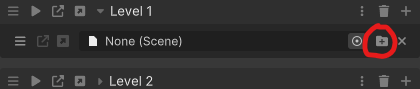

**Main menu**

Now, lets open the main menu scene by pressing the open scene button or the open collection button. Style your main menu as you want, but add two buttons, "Level 1" and "Level 2". Select the button for level 1 and add a On Click () handler to the Button script, then hold and drag from the collection header for "Level 1", this will start a drag drop for that collection, drop it on the button click handler. Then select SceneCollection > _Open (bool). Then do the same for the second level collection. Then add a "Quit" button, for this On Click () handler, drag and drop the scene helper button instead, which is to the left of the new collection button. Then select ASMSceneHelper > Quit ().

> The collection open toggle is not important right now, but it specifies whatever all scenes on a collection should open, since some scenes may be flagged to not open automatically, only explicitly.

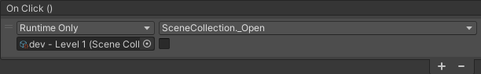

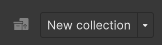

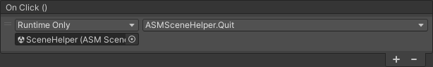

**Play**

Now when you press the play button, you'll be taken to the main menu in the same manner as before, but you can now press a level button to be taken to that level. To go back to main menu, press the ASM play button once more, and ASM will restart (but skip splash screen). Now press the quit button, and ASM will fade out, then exit play mode.

> Note that you do not have to use quit function to quit your game, it is merely an convenience feature.

**Using Start() and Awake()**

Start and awake are still Unity callbacks, so they still functions as normal. But it's important to be aware that these callbacks are often called before ASM has finished it's loading jobs. Therefor if you need all scenes in a collection to be loaded before you initialize code or run logic, use our callbacks. And so ASM does not always support opening scenes or collections (especially collections), in these callbacks. A lot of new users seem to miss this, so please also read this section: [scene callbacks](Callbacks.md). (This is often used when developing with ASM.) 

> A common misuse is to instantiate gameobjects in Start, resulting in the object being loaded into the wrong scene, as ASM has not yet updated the active scene, then it's common to use ICollectionOpen to instantiate.

**Done**

And with that, we're done! Enjoy working on your game instead of getting bogged down in scene management!
