<!---./Quick-start.md-->
[← Back](readme.md) | [🏠 Home](readme.md)

## Quick Start

## Install ASM

1. Open **Unity**.
2. Go to **Window → Package Manager**.
3. Search for **Advanced Scene Manager**.
4. Click **Install** and wait for Unity to compile.

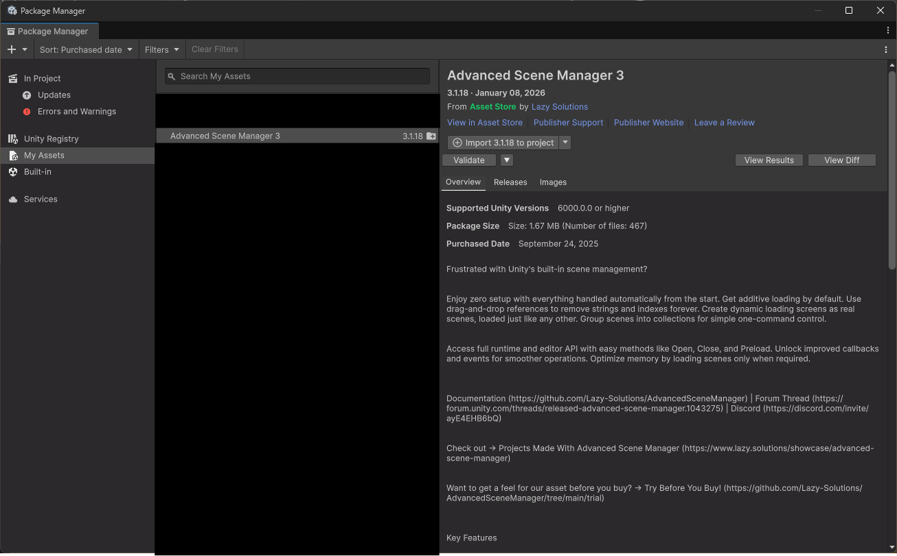

## Open the Scene Manager

Go to:

**File → Scene Manager…**

## Create a Profile

In the lower-left corner of the Scene Manager window:

1. Click the profile selector.
2. Create a new profile:
   - If none exist, click **Create**
   - If profiles exist but none are selected, choose **None**
   - Otherwise, click the current profile name to create a new one.

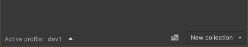

## Default Profile Overview

The default profile includes two collections:

- **Startup (persistent)**
- **Main Menu**

Open the collection menu (⋮) on each header and observe:

- Both collections are set to open at startup.
- The **Startup** collection has **Open Persistent** enabled under *Open Options*.

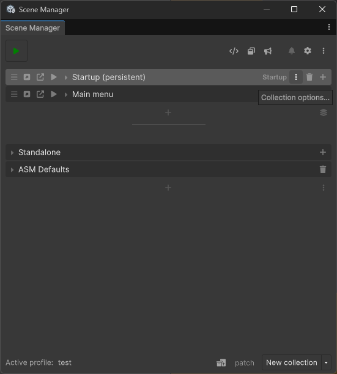

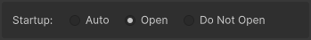

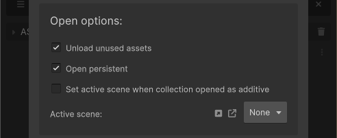

## Create Scenes

Create two scenes as usual:

- `Startup`
- `Main Menu`

## Import Scenes into ASM

After creating the scenes, a notification will appear in the Scene Manager window.

1. Click the notification to open the import popup.
2. Ensure both scenes are toggled.
3. Press **Import**.

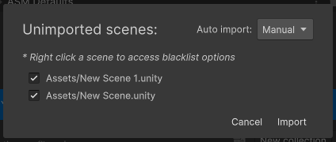

## Assign Scenes to Collections

Drag each scene into its corresponding collection and drop it onto the **Drop Area**.

## Press Play (ASM Play Button)

In the top-left of the Scene Manager window, press the **Play** button.

ASM will:

1. Enter Play Mode  
2. Fade out  
3. Show the ASM splash screen  
4. Open the collection scenes  
5. Fade in

The **Main Menu** scene should now be active in the Hierarchy.

This button runs the ASM startup process, simulating a build.

> If the splash screen is not set to default, it'll look slightly different, but collections will still be opened.

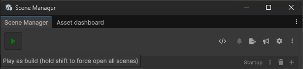

# Creating Levels

## Create Level Collections

Create two new collections:

- `Level 1`
- `Level 2`

Instead of creating scenes in the Project window:

1. Press **+** in the collection header.
2. Click **Create Scene** next to the object field.
3. Name each scene the same as its collection.

Also:

- Create a `UI` scene.
- Assign it to both level collections.

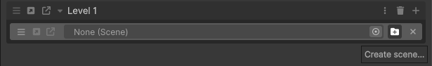

# Main Menu Setup

Open the **Main Menu** scene.

Add three buttons:

- **Level 1**
- **Level 2**
- **Quit**

### Connect Level Buttons

For each level button:

1. Add an **On Click()** handler.
2. Drag the collection header (Level 1 or Level 2).
3. Drop it into the On Click field.
4. Select:  
   `SceneCollection → Open(bool)`

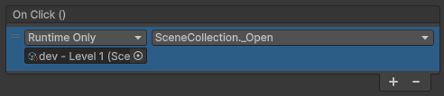

Repeat for the second level.

### Connect Quit Button

1. Add an **On Click()** handler.
2. Drag the **Scene Helper button** (left of the New Collection button).
3. Select:  
   `ASMSceneHelper → Quit()`
   
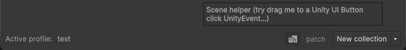
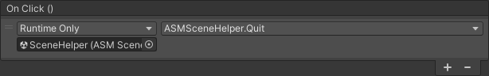

> The collection open toggle defines whether all scenes in a collection should open automatically. Individual scenes can be configured to require explicit opening.

# Test It

Press the ASM Play button.

You will:

- Start in the Main Menu
- Be able to load Level 1 or Level 2
- Restart ASM by pressing the ASM Play button again (splash is skipped)
- Quit Play Mode using the Quit button

> You do not need to use `Quit()` to exit your game. It is provided as a convenience feature.

# About `Start()` and `Awake()`

Unity callbacks still work as normal. However:

`Start()` and `Awake()` run **before ASM finishes opening its collection scenes**.

If your logic depends on all scenes being loaded, use ASM callbacks instead:

- [`ISceneOpen`](callbacks/Interface-callbacks.md)
- [`ICollectionOpen`](callbacks/Interface-callbacks.md)

> Note that `Start()` and `Awake()` also run before ASM activates the correct scene, which can lead to object instantiation in an unexpected scene. Using the above callbacks prevents this issue.

# Done

You now have:

- Startup scene
- Main Menu
- Two levels
- Collection-based scene flow
- Proper loading transitions

You are ready to build your game without manual scene management.

## Related Pages

[📄 Quick start](Quick-start.md)  
[📄 Common questions](Common-questions.md)  
[📄 In-game toolbar](In-game-toolbar.md)  
[📄 Updating](Updating.md)  
[📄 Videos](Videos.md)

[← Back](readme.md) | [🏠 Home](readme.md)
