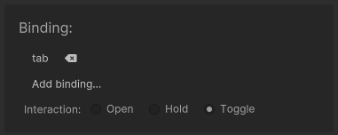

# Scene bindings

Scene bindings are used to open collections or scenes through a key or button binding.

[Collections](Scene%20collections.md) can be bound using the [collection popup](Scene%20manager%20window.md#collection-popup).\
[Standalone scenes](Standalone%20scenes.md) can be bound using the scene menu.

Interaction can be used to specify when the collection or scene should close.
* Open: Only open, don't close.
* Hold: Keep open when button held down, then close on release.
* Toggle: Toggle scene open or closed on button down.

