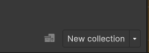

# Scene helper

The scene helper is a [ScriptableObejct](https://docs.unity3d.com/Manual/class-ScriptableObject.html) that is provided to make it easier to open collections or scenes in [UnityEvent](https://docs.unity3d.com/Manual/UnityEvents.html). Most methods found on scene helper can also be found on scene and collections, but it might be easier to find the methods you want on scene helper, since there is less methods unintentionally listed when selecting one.

Scene helper can be found on the scene manager window, next to the new collection button. Just drag from the button to gain a reference.

It can also be accessed in code:\
`AdvancedSceneManager.Models.ASMSceneHelper.instance`
