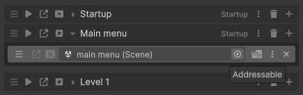

# Scene Loaders

Scene loaders are what Scene operations use to actually load or unload a scene. They modularize scene loading, allowing ASM to support different loading mechanisms — whether runtime, editor, addressables, or even multiplayer (Netcode).

There are four scene loaders included with ASM:

- **RuntimeSceneLoader** — uses [UnityEngine.SceneManagement](https://docs.unity3d.com/ScriptReference/SceneManagement.SceneManager.html). Always active in play mode.
    
- **EditorSceneLoader** — uses [UnityEditor.SceneManagement.EditorSceneManager](https://docs.unity3d.com/ScriptReference/SceneManagement.EditorSceneManager.html). Used outside of play mode.
    
- **AddressablesSceneLoader** — uses Unity's [Addressables](https://docs.unity3d.com/Manual/com.unity.addressables.html) system for loading scenes marked as addressable.
    
- **NetcodeSceneLoader** — used when working with Unity's [Netcode for GameObjects](https://docs-multiplayer.unity3d.com/netcode/current/about/), syncing scenes across clients and servers.
    

> Runtime and Editor scene loaders are **global** — they match all scenes unless overridden. Addressables and Netcode scene loaders are **non-global** — only apply to scenes flagged for them.

To flag a scene to use a specific loader, use:

```csharp
Scene.SetSceneLoader<YourLoader>();
```

You’ll see the result of this in the scene popup (UI) as a toggle if the loader defines `sceneToggleText`.


## Scene Loader API

To create a custom scene loader, inherit from:

```csharp
AdvancedSceneManager.Core.SceneLoader
```

Example:

```csharp
class MyCustomLoader : SceneLoader
{
    public override bool activeOutsideOfPlayMode => true;
    public override string sceneToggleText => "Use custom loader";
    public override bool isGlobal => false;

    public override IEnumerator LoadScene(Scene scene, SceneLoadArgs e)
    {
        Debug.Log("Loading scene: " + scene.name);
        yield return new WaitForSeconds(1f); // Simulate load
        e.SetCompleted(e.GetOpenedScene());
    }

    public override IEnumerator UnloadScene(Scene scene, SceneUnloadArgs e)
    {
        Debug.Log("Unloading scene: " + scene.name);
        yield return new WaitForSeconds(1f); // Simulate unload
        e.SetCompleted();
    }
}
```

To register your loader:

```csharp
[RuntimeInitializeOnLoadMethod]
static void OnLoad()
{
    SceneManager.runtime.AddSceneLoader<MyCustomLoader>();
}
```

You can also unregister it with:

```csharp
SceneManager.runtime.RemoveSceneLoader<MyCustomLoader>();
```

## Indicators and Toggles

Custom scene loaders can define:

```csharp
public override Indicator indicator => new()
{
    text = "",
	useFontAwesome = true
};
```

This will appear as an icon next to scenes using this loader.


## Loader Selection Logic

ASM uses the following logic to choose a scene loader:

1. If a scene is flagged for a loader via `SetSceneLoader<T>()`, that loader is used.
    
2. If multiple loaders match, the first one registered takes priority.
    
3. If no match is found, the global loaders are used (Runtime or Editor).