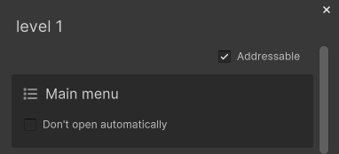

# Scene loaders

Scene loaders are what [Scene operations](Scene%20operations.md) use to actually load or unload a scene. Scene loaders allows ASM to modularize our scene loading and support different ways of loading scenes if need be.

There are currently four scene loaders in ASM:
* **RuntimeSceneLoader**, uses [UnityEngine.SceneManagement](https://docs.unity3d.com/ScriptReference/SceneManagement.SceneManager.html) APIs.
* **EditorSceneLoader**, uses [UnityEditor.SceneManager](https://docs.unity3d.com/ScriptReference/SceneManagement.EditorSceneManager.html) APIs, and adds a couple of extra features for working in the editor.
* **AddressablesSceneLoader**, uses [addressable](https://docs.unity3d.com/Manual/com.unity.addressables.html) APIs.
* **NetcodeSceneLoader**, uses [netcode](https://docs-multiplayer.unity3d.com/netcode/current/about/) APIs.

RuntimeSceneLoader and EditorSceneLoader are global scene loaders, they can match any scene.
AddressablesSceneLoader and NetcodeSceneLoader are non-global scene loaders, they can only match scenes that have been flagged.

Scenes can be flagged programmatically using:\
`Scene.SetSceneLoader<T>()`



## Custom scene loader

Implementing a custom scene loader can be done inheriting from:\
`AdvancedSceneManager.Core.SceneLoader`

```csharp
class SpecificSceneLoader : Core.SceneLoader
{

	//Specifies that this loader can be used outside of play mode
	public override bool activeOutsideOfPlayMode => false;

	//Displays a toggle will be displayed in scene popup to flag a scene for use with this loader.
	//Scene.SetSceneLoader<SpecificSceneLoader>() can also be used.
	public override string sceneToggleText => "Custom loader";

	//Specifies that this loader can be used for all scenes
	//Must be false for this loader to only apply to certain scenes
	public override bool isGlobal => false;

	public override IEnumerator LoadScene(Scene scene, SceneLoadArgs e)
	{

		Debug.Log("Custom loader: Load: " + scene.name);

		//TODO: Implement functionality

		//Must be called to let ASM know that you're done
		e.SetCompleted(e.GetOpenedScene());
		
		yield break;

	}

	public override IEnumerator UnloadScene(Scene scene, SceneUnloadArgs e)
	{

		Debug.Log("Custom loader: Unload: " + scene.name);

		//TODO: Implement functionality
	
		//Must be called to let ASM know that you're done
		e.SetCompleted();
		yield break;

	}

}
```

The above example is an example contained within ASM, have a look inside\
`/Assets/AdvancedSceneManager/Example scripts/`\
for more examples.

To make ASM use your custom scene loader you need to register it.

```csharp
[RuntimeInitializeOnLoadMethod]
static void OnLoad()
{
	//Conflicts can occur if multiple global ones are enabled at the same time.
	SceneManager.runtime.AddSceneLoader<SpecificSceneLoader>();
}
```

You may also unregister your scene loader, or any other if you are able to access the type, *but that is obviously not recommended.*\
`SceneManager.runtime.RemoveSceneLoader<SpecificSceneLoader>();`

