# Scene manager window

The scene manager window is the front-end for ASM. It can be used to manage [collections](Scene%20collections.md), [scenes](Scenes.md), and behavior of ASM.

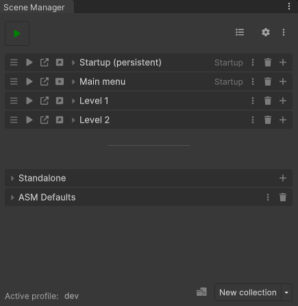

The scene manager window can be opened through:

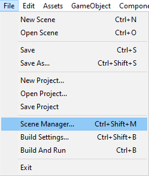

## Main view
### Header

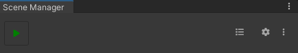

The header contains the following, in order, left to right:
* Play button, enters play mode and runs startup process, as if we're running in a build.
* Overview button, opens a popup presenting all scenes in project.
* Settings button, displays the [settings popup](#settings-popup).
* Menu button, displays the [menu popup](#menu) with some useful tools.

### Collections and scenes

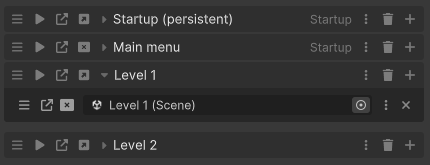

The collections and scene list contain... collections and scenes!

#### Collection header
The elements in the [collection](Scene%20collections.md) header are as follows, in order, left to right:
* Reorder collections.
* Enter play mode and open collection when startup process done *(startup process when using this button can be turned off in settings)*.
* Open collection.
* Open / close collection as additive.
* Collection title
* Collection menu button, opens a popup containing settings for the given collection.
* Remove button, removes the collection.
* Add scene field button.

> Note that some elements may be hidden, check settings for more.

#### Scene field
The elements on the [scene](Scenes.md) field are as follows, in order, left to right:
* Reorder scenes.
* Open scene.
* Open / close scene as additive.
* Scene selector (could also be called scene field, conflicting terms here).
* Indicators *(not visible in image above)*.
* Scene menu button, opens a popup containing settings for the scene, some global, some specific to parent collection.
* Delete button, deletes the scene field.

> Note the terms *Remove* and *Delete*, Remove is used to describe a reversible action here, whereas delete will not provide option to undo.

> Collection headers and scenes may be dragged to gain a drag drop reference.

### Dynamic collections and scenes

Dynamic collections are collections that contain scenes that do not fit within a normal collection, but are still supposed to be included in build. This is needed because ASM manages the build scene list (adding a scene to list manually just causes ASM to add it to standalone collection).

The **[standalone](Standalone%20scenes.md)** is a special dynamic collection, it allows you to add scene fields and modify its scene list, it also cannot be deleted. 

The **ASM Defaults** dynamic collection on the other hand is a normal dynamic collection, it takes a path to a folder, and gathers all scenes found within its subfolders. The folder path can be configured in the collection popup.

> The stars in the image above are persistent indicators, these scenes will not be closed automatically by ASM, only when user requests it *(or by scene bindings in this case, see scene popup for more information)*.

### Footer

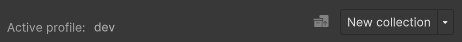

The footer contains, in order, left to right:
* [Profile](Profiles.md) selector, opens a popup where a profile can be selected, or created.
* [Scene helper](Scene%20helper.md) button, provides an easy way to gain a drag drop reference to scene helper scriptable object, which can be used in UI button click, for example.
* New collection split button, pressing dropdown section opens a popup where you can create a dynamic collection, or create normal collection from a template.

## Collection popup

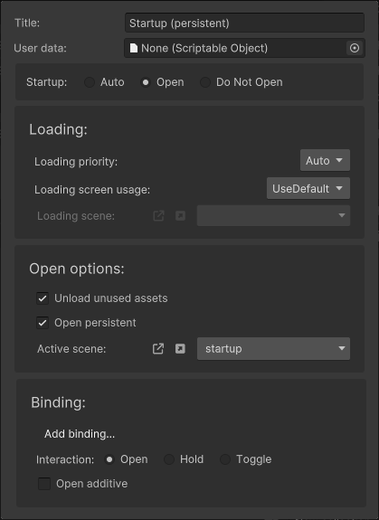

The collection popup contains:
* **Title**
* **User data**, which can be used to associate custom scriptable object with collection, retrievable by `SceneCollection.UserData<T>()` or `SceneCollection.UserData()`. They can implement scene callbacks as well.
* **Startup**, determines if collection should be opened by ASM during startup. Auto means ASM will open collection if it is first collection in list, and and no other collection is specified as *open*.
* **Loading priority**, when not set to *auto*, ASM will automatically set corresponding [ThreadPriority](https://docs.unity3d.com/ScriptReference/ThreadPriority.html) when scene operation begins, on collection open / close, and then reset it when done.
* **Loading screen usage**, determines if default loading screen should be used, or if it should be overridden, or disabled.
* **[Loading scene](Loading%20scenes.md)**, determines loading scene to use when above is set to override.
* **Unload unused assets**, if true then ASM will automatically call [Resources.UnloadUnusedAssets](https://docs.unity3d.com/ScriptReference/Resources.html) when scene operation, on collection open / close, is done.
* **Open persistent**, determines if all scenes within should be opened as persistent.
* **Active scene**, specifies scene to activate when opening collection.
* **Binding**, specifies a input binding that can be used to open collection when pressed *(only available when [InputSystem](https://docs.unity3d.com/Packages/com.unity.inputsystem@1.7/manual/index.html) is installed)*.
* **Interaction**, specifies whatever binding will automatically close collection.
	* **Open**, do not close, only open.
	* **Hold**, close collection when binding is released.
	* **Toggle**, close collection on next press.
* **Open additive**, opens the collection as additive when using binding.

# Scene popup

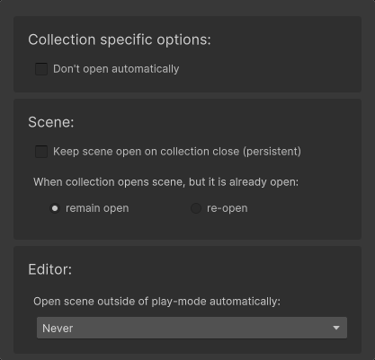

The scene popup contains:
* **Do not open automatically**, specifies whatever this scene should remain closed when collection is opened, use this when you want to open scene yourself, but still want scene associated with collection. *This is a collection specific setting, and is saved on parent collection.*
* **Keep scene open on collection close (persistent)**, specifies that this scene should not be closed by ASM automatically, only when user explicitly closes scene directly.
* **When collection opens scene, but it is already open**, specifies what ASM should do when scene is already open when a collection opens it.
* **Open scene outside of play-mode automatically**, specifies that ASM should open this scene additively, *outside of play-mode*, when another scene opens.

> *Collection specific options* section contains settings that are related to the current parent collection only, when assigning scene to multiple collections, this section will be different depending on collection. **All other sections are global.**
# Menu popup

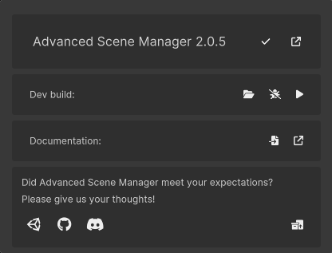

The menu popup contains:
* **Current version**, version check and link to view available patches *(patches are .UnityPackage(s) that we provide outside of the normal unity asset store updates, that fixes bugs, and even sometimes provide new features, but could potentially be unstable, we try our hardest though!)*.
* **Dev build**, provides a quick way to build your project during development. Folder can be specified using folder button, and profiler can be attached using bug button. Press play button to build and run.
* **Documentation**, provides shortcuts to local docs, and online docs.
* **Contact**, ASM appreciates your feedback, bug reports and suggestions alike! Also contains a button to view example projects.
# Settings popup

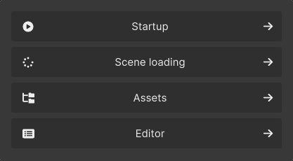

The settings popup contains the configration options of ASM. Settings are categorized into multiple pages:
* **Startup**, contains settings related to the startup process, or more simply, what scenes or collections should be opened when game starts.
* **Scene loading**, contains settings that define how ASM should behave when loading scenes.
* **Assets**, contains settings relating to ASM assets, like ASM scenes, collections and profiles.
* **Editor**, contains settings that define how ASM behaves in the editor.
* **Netcode** *(not visible in image above, as it is only shown when [netcode for gameobjects](https://docs-multiplayer.unity3d.com/netcode/current/about/) package is installed)*, contains settings relating to our netcode plugin.

## Startup page

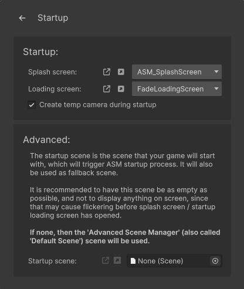

The startup page contains:
* **Splash screen**, displays a splash screen when game starts.
* **Loading screen**, displays a splash screen during the startup process *(this is useful since its common to open multiple collections for example, standalone scenes may also be opened)*.
* **Create temp camera during startup**, if there is no camera during startup, one will be created, this may sometimes cause issues, so you may want to disable this then.
* **Startup scene**, this is the first scene that will be opened, it should be mostly empty, since otherwise you'll get flickering during startup. This should only be used in very rare use-cases, normally you'd just use collections and standalone scenes flagged to open during startup.
## Scene loading page

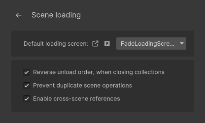

The scene loading page contains:
* **Default loading screen**, this is the loading screen that will be used when opening or closing collections, if none is explicitly defined in the collection settings.
* **Reverse unload order, when closing collections**, specifies that scenes should unload bottom up (when viewed in scene hierarchy).
* **Prevent duplicate scene operations**, sometimes, such as when player is spamming a UI button that will open a scene / collection, you probably do not want duplicate operations, this attempts to prevent that. *Note that a better solution may still be to disable buttons or similar, since that would be more fool-proof.*
## Assets page

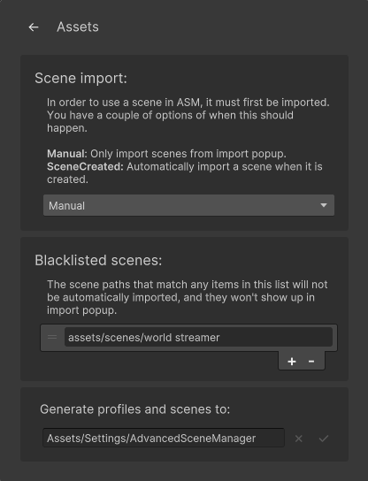

The assets page contains:
* **Scene import option**, specifies whatever scenes created *normally* will be automatically imported into ASM. Non-normal would mean creating scene on disk outside of unity, or pulling non-imported scene file from source, those will still have to be explicitly imported in scene import popup.
* **Blacklisted scenes**, specifies blacklisted scenes or folders. Any scenes found at path, or inside subfolders of path, will never be automatically imported, and ASM will not include them in import popup.
* **Generate profiles and scenes to**, specifies the path ASM will generate ASM assets to, if you do not wish to generate them to the default path. This only affects where ASM will put the assets on generation, you will still have to move the assets manually, which is fine to do, to be clear, ASM keeps and internal list of its own assets by reference, so you can move them wherever you want.
## Editor page

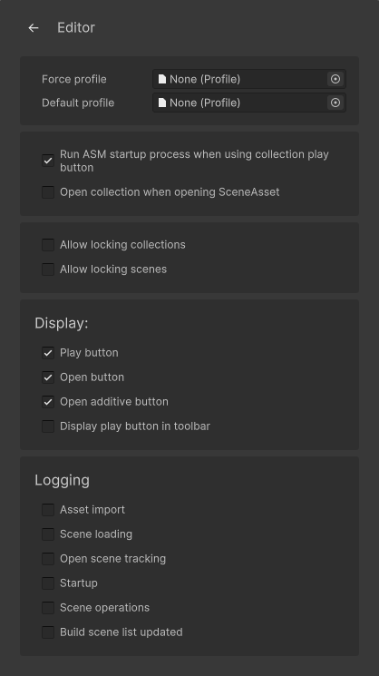

The editor page contains:
* **Force profile**, specifies a profile that is force enabled, useful for teams that wish to have only one person manage ASM.
* **Default profile**, specifies a default profile that will be enabled whenever ASM cannot find an active profile during editor initialization.
* **Run ASM startup process when using collection play button**, specifies whatever ASM should run startup process before opening collection when pressing collection play button.
* **Open collection when opening SceneAsset**, specifies that, *in editor*, that when double clicking a scene, ASM should open the first collection found that the scene is contained within, instead of just opening the scene on its own.
* **Allow locking collections**, specifies that a lock symbol should be shown in collection settings. When locked, a collection becomes read-only. *Only applied to Scene manager window UI, not when editing values directly on scriptable objects, or in notepad or git for example.*
* **Allow locking scenes**, specifies that a lock symbol should be shown in scene hierarchy. When locked, and user attempts to save after modifying it, a prompt will popup asking to save to a new file, or to cancel. *Only applied when saving normally, no effect when modifying scene file in notepad for example, or pulling from git.*
* Display:
	* **Play button**, specifies whatever collection play buttons should be visible.
	* **Open button**, specifies whatever collection open buttons should be visible.
	* **Open additive button**, specifies whatever collection open additive buttons should be visible.
	* **Display play button in toolbar**, *hidden unless [marijnz/unity-toolbar-extender](https://github.com/marijnz/unity-toolbar-extender) package is installed*, displays an ASM play button in the toolbar, next to the regular play button.
* Logging:
	* **Asset import**, displays a log message when an ASM asset is imported, or un-imported.
	* **Scene loading**, displays a log message when a scene is loaded, or unloaded.
	* **Open scene tracking**, displays a log message when a scene is tracked, or untracked.
	* **Startup**, displays log messages when running startup.
	* **Scene operations**, displays log messages when a scene operations are busy.
	* **Build scene list updated**, displays a log message when build scene list is updated.

> The logging messages are only used to debug, 99% of users do not need to enable these, unless they want to.
