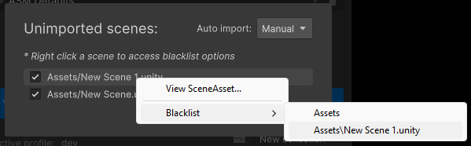

# Scenes

Scenes in ASM are represented as [ScriptableObject](https://docs.unity3d.com/Manual/class-ScriptableObject.html), this is to provide a simple drag drop interface for scenes.

To retrieve a reference to a ASM scene, when all you've got is a unity scene struct, you may use any of the following:

```csharp
public class Test : MonoBehaviour
{
	
	void Start()
	{
		//Returns null if not imported, or found.
		var scene1 = this.ASMScene();
		var scene2 = this.gameObject.ASMScene();
		var scene3 = this.gameObject.scene.ASMScene();
		
		//All the above also have overloads like this
		if (this.ASMScene(out var scene4))
		{ }
		
		//Equivivalent to SceneManager.runtime.activeScene.
		var activeScene = UnityEngine.SceneManagement.SceneManager.GetActiveScene().ASMScene();

	}

}
```

## Drag-and-drop can be used for the following scenarios:

### Add scene to a collection, or replace existing scene field.


### UnityEvent

[Button](https://docs.unity3d.com/Packages/com.unity.ugui@1.0/manual/script-Button.html) On Click () handler for example:


### Scripts:

```csharp
using AdvancedSceneManager.Models;

public class OpenScene
{
  
  public Scene scene;

  public void Open()
  {
  	scene.Open();
  }

}
```

## Importing

Scenes must be imported to be used in ASM. You can do so by pressing the notification in the scene manager window.


Scenes can be unchecked to not import them at this time.


Scenes may be blacklisted so they don't show up. Blacklisting a folder will result in all scenes inside the folder, including subfolders, will also be ignored.



Finally, just press import, and the imported scenes will now be usable in ASM.

Blacklist can be configured in [settings](<Scene manager window.md#assets-page>).

> Whitelist is also available since ASM 2.2.

## Persistent scenes

Persistent scenes are scenes that do not automatically close when a collection is closed. This can be specified in the [scene popup](<Scene manager window.md#scene-popup>).

## Preloading

A scene can be preloaded by calling `Scene.Preload()`, or by using [scene helper](<Scene helper.md>). Only one scene may be preloaded at a time, and no other scene operations can occur while one is, _this is a unity limitation_.

```csharp
using AdvancedSceneManager.Models;
using UnityEngine;

public class PreloadTrigger : MonoBehaviour
{

    public Scene sceneToPreload;

    void OnTriggerEnter(Collider other)
    {
        if (!sceneToPreload.isOpen && !sceneToPreload.isPreloaded)
            sceneToPreload.Preload();
    }

    void OnTriggerExit(Collider other)
    {
        //User exited trigger, and since FinishPreload() has
        //not been called if .isPreloaded is true, that means
        //the user went backwards
        if (sceneToPreload.isPreloaded)
            SceneManager.runtime.CancelPreload();
    }

    //Called from other, overlapping, trigger
    public void FinishPreload()
    {
        if (sceneToPreload.isPreloaded)
            SceneManager.runtime.FinishPreload();
    }

}
```

The currently preloaded scene can be retrieved statically by using:\
`AdvancedSceneManager.SceneManager.preloadedScenes;`

## Scene tracking

When a scene is loaded in ASM it needs to be tracked, to be considered open. Tracking a scene in ASM is usually automatic, and not something users need to worry about.

When a scene is open, but untracked, an indicator will be shown in the hierarchy, when in the editor. This may happen temporarily, and then resolve itself a moment later. This is, in most cases, by design. It is during prolonged cases when it may be a bug, or conflict with another scene manager.


#### Tracking scenes manually

If you are combining ASM with another scene manager, such as a network scene manager, you may sometimes have to track scenes in ASM manually, to ensure ASM works as expected.

Also, since the terms will be a bit confusing, some clarification is needed: **Scene / ASM Scene**: `AdvancedSceneManager.Models.Scene` **unityScene**: `UnityEngine.SceneManagement.Scene`

unityScene is Unitys own representation of a loaded scene, in code. When tracking an ASM scene, you are also linking an instance of unityScene with an ASM Scene.

```csharp
//You may track scenes using one of the following two methods. You don't need to worry about duplicate calls.
SceneManager.runtime.Track(scene1, unityScene); 
SceneManager.runtime.Track(scene1); //Will try to automatically find unityScene, unless Scene.internalScene already has a value.

Debug.Log(SceneManager.runtime.IsTracked(scene1)); //Should log true

SceneManager.runtime.Untrack(scene1);

//Use these when you want to untrack all collections or scenes.
SceneManager.runtime.UntrackCollections();
SceneManager.runtime.UntrackScenes();
```

> Be careful to pass correct unityScene when using `SceneManager.runtime.Track(Scene, unityScene)`, there are no validation checks, ASM expects this to have been done prior.

> Note that calling `SceneManager.runtime.Track(Scene, unityScene)` on an already tracked scene, will result in `Scene.internalScene` being replaced with new unityScene, but ASM will not track ASM scene twice.

## Scene merging

Scenes can be merged by ctrl selecting two or more scenes in the [scene manager window](<Scene manager window.md>), and right clicking, then selecting 'merge scenes...'.


Scenes can be merged programmatically as well:\
&#xNAN;_&#x4F;nly usable in editor_\
`SceneUtility.MergeScenes(targetScene, sceneToMergeIntoTargetScene); //Can accept multiple scenes in second argument`

## Scene splitting

Scenes can be split up into multiple by selecting two or more [GameObjects](https://docs.unity3d.com/Manual/class-GameObject.html) in the hierarchy.

 

Scenes can be split up programmatically as well:\
&#xNAN;_&#x4F;nly usable in editor_\
`SceneUtility.MoveToNewScene(gameObject); //Moves current game object into a new scene, method supports multiple objects`
