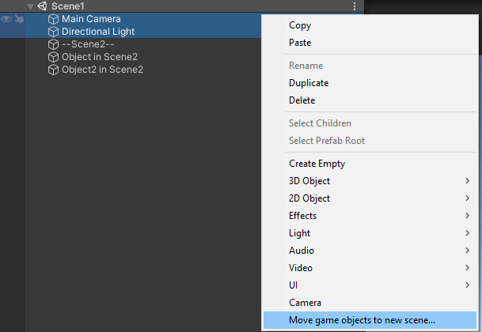

# Scenes

Scenes in ASM are represented as [ScriptableObjects](https://docs.unity3d.com/Manual/class-ScriptableObject.html), providing a convenient drag-and-drop interface for scene references.
## Accessing ASM Scene References

If you only have a Unity `Scene` struct and need to retrieve the ASM `Scene` object, use any of the following:

```csharp
public class Test : MonoBehaviour
{
    void Start()
    {
        var scene1 = this.ASMScene();
        var scene2 = this.gameObject.ASMScene();
        var scene3 = this.gameObject.scene.ASMScene();

        if (this.ASMScene(out var scene4))
        { }
        
        //Side note, this can be used to retrieve active scene.
        var activeScene = SceneManager.runtime.activeScene;
    }
}
```

## Drag-and-Drop Use Cases

- Add or replace scenes in a collection
 
    
- Assign to UnityEvents (e.g., Button → OnClick)
  
    
- Reference in scripts:
```csharp
using AdvancedSceneManager.Models;

public class OpenScene
{
    public Scene scene;

    public void Open()
    {
        scene.Open();
    }
}
```

> ❗ **Methods prefixed with ****`_`** are intended for use in UnityEvents. This is because UnityEvents do not support methods with return values or multiple parameters.

## Importing Scenes

Scenes must be imported before they can be used in ASM. This is done via the **import prompt** in the Scene Manager window:


Auto import: SceneCreated can be optionally set. This means that ASM will automatically import scenes when they are created through normal means.

You can exclude scenes via the blocklists feature (configurable later in settings):

## Persistent Scenes

A **persistent scene** remains open when switching collections. Enable this in the scene popup. This is useful for UI overlays, managers, and persistent objects.

## Preloading

Preloading allows scenes to be loaded in the background and activated later. ASM supports **multiple preloaded scenes**, assuming Unity allows it.

Example:

```csharp
public class PreloadTrigger : MonoBehaviour
{
    public Scene sceneToPreload;

    void OnTriggerEnter(Collider other)
    {
        if (!sceneToPreload.isOpen && !sceneToPreload.isPreloaded)
            sceneToPreload.Preload();
    }

    void OnTriggerExit(Collider other)
    {
        if (sceneToPreload.isPreloaded)
            SceneManager.runtime.CancelPreload();
    }

    public void FinishPreload()
    {
        if (sceneToPreload.isPreloaded)
            SceneManager.runtime.FinishPreload();
    }
}
```

Use `SceneManager.preloadedScenes` to retrieve currently preloaded scenes.

## Scene Load Priority

Each scene can be assigned a **load priority**, which maps to `Application.backgroundLoadingPriority`. This setting affects the background loading behavior and system thread priority used when loading the scene. It is useful for optimizing loading times in large projects for large scenes, or loading scenes in the background.

## Scene Loaders

ASM supports different loaders depending on what API should be used to load scene. A few exist out of the box, assuming the corresponding upm package are installed. Custom loaders are also supported. 

Read more in [Scene Loaders](scene%20loaders.md).

The loader assigned to a scene can be toggled via the **Scene Popup** in the ASM window.


## Input Bindings

Standalone scenes can be opened via input using scene bindings, just like collections. Bind a key such as `Escape` or `Tab` to toggle UI scenes like pause menus.

## Startup Scenes

Standalone scenes can be marked to open during **startup**, independently of collections. These are opened **after** collections are opened, making them ideal for persistent UI, background managers, or debug overlays.

## Scene Tracking

ASM automatically tracks scenes when opened through its API. In rare integration cases (e.g., with a network scene manager), you may need to track scenes manually:

```csharp
SceneManager.runtime.Track(scene, unityScene);
SceneManager.runtime.Untrack(scene);
```

When a scene is open, but untracked, an indicator will be shown in the hierarchy, when in the editor. This may happen temporarily, and then resolve itself a moment later. This is, in most cases, by design. It is during prolonged cases when it may be a bug, or conflict with another scene manager.

## Scene Merging and Splitting

Merge scenes via right-click in the scene manager window:


Split GameObjects into new scenes via the hierarchy context menu:


Or via code:
```csharp
SceneUtility.MergeScenes(targetScene, scenesToMerge); // Editor only
SceneUtility.MoveToNewScene(gameObject);              // Editor only
```
