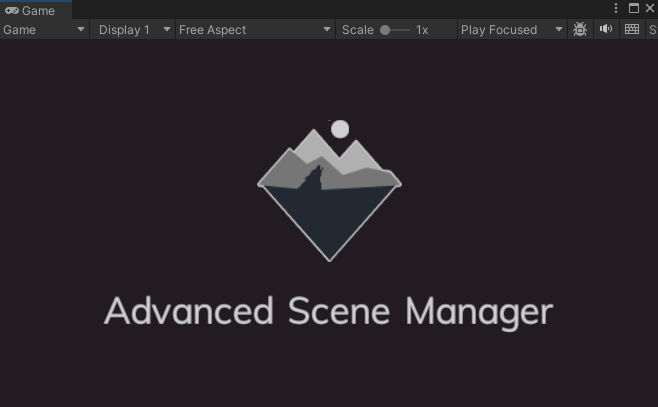

# Splash screens

Splash screens are displayed before the game starts. There is one included in ASM by default, **ASM_SplashScreen**.



Splash screens are specified in [ASM startup settings](Scene%20manager%20window.md#startup-page).
## Custom splash screens

Custom splash screens can be created by creating a script that inherits from `AdvancedSceneManager.Callbacks.SplashScreen`, and implement `DisplaySplashScreen()`.

> In the following example, `CanvasGroup.Fade()` is used, it is an extension method provided by ASM to fade out canvas UI.

```csharp
public class ASM_SplashScreen : Callbacks.SplashScreen
{

    public CanvasGroup group;
    public Image background;
    public Image logo;
    public float fadeDuration = 1;
    public float waitDuration = 2.5f;

	void Start()
	{
	
		group.alpha = 0;
		//Use same color as unity splash screen, if enabled, defaults to black otherwise
		background.color = SceneManager.settings.project.buildUnitySplashScreenColor;
	
	}

	void Update()
	{
		//Skip splash screen when any of the buttons are pressed
		if (IsSkipButtonPressed()) //Method omitted for brevity
			coroutine?.Stop();
	}

	GlobalCoroutine coroutine;

	public override IEnumerator DisplaySplashScreen()
	{
	
		coroutine?.Stop();
		//Run the coroutines in a 'chain', this makes it easier to cancel splash screen on skip button
		coroutine = CoroutineUtility.Chain(
			() => group.Fade(1, fadeDuration),
			() => new WaitForSecondsRealtime(waitDuration),
			() => group.Fade(0.01f, fadeDuration));
		
		yield return coroutine;
		group.alpha = 0;
	
	}

}
```

When script is finished, place it in a dedicated scene and assign scene as splash screen in [ASM startup settings](Scene%20manager%20window.md#startup-page).

> Note if a custom splash screen is not showing up, you may have to modify the scene and save it *(note that scene must be dirty for it to save to disk)*, for the splash screen flag to appear.
