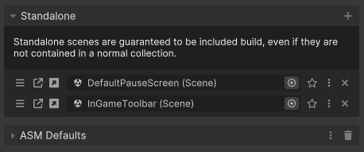
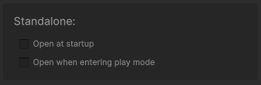
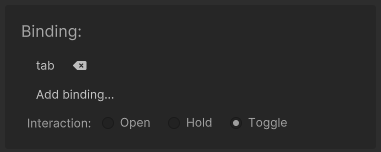

# Standalone scenes

Standalone scenes are scenes that do not belong to a collection, but are still to be included in build. ASM has a special dynamic collection that you should add such scenes to.

## Startup

Scenes in this section have the ability to open during startup, or when entering play mode, in the editor. *These settings are contained within the scene menu, accessible using the menu button.*

## Input bindings

Standalone scenes can also be opened through [bindings](Scene%20bindings.md).

