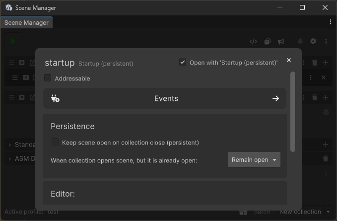

# Addressables

When the [Addressables](https://docs.unity3d.com/Manual/com.unity.addressables.html) package is installed, **ASM provides optional support for loading scenes using the Addressables system**.

To enable this, toggle the **“addressable”** option for a scene in the scene popup. This applies to both collection scenes and standalone scenes.

The collection popup also includes a bulk toggle to mark all scenes in the collection as addressable.

> When ASM adds a scene to Addressables, it places it in a default group. **ASM does not assign a schema** to this group, you should either assign one manually or move the scene to another group.

