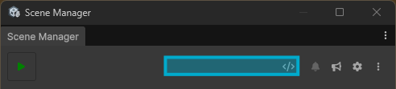
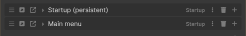
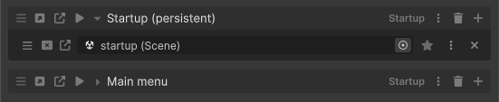
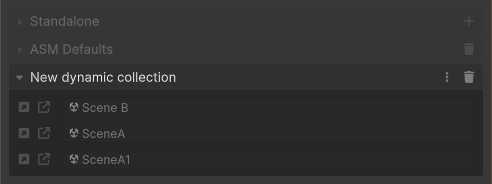
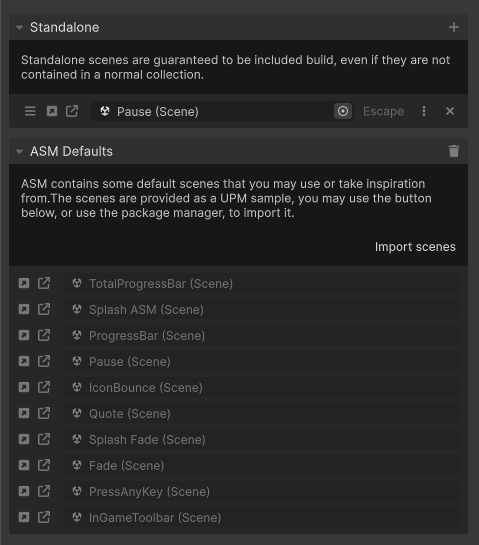

<!---asm-window/main.md-->
[← Back](readme.md) | [🏠 Home](../readme.md)
## Main view
### Overview

The main view is divided into several distinct areas:

- [Header](#header)
- [Scene collections](#scene-collections)
- [Dynamic collections](#dynamic-collections)
- [Special collections](#special-collections)
- [Footer](#footer)

## Header

The header includes:

- **ASM Play Button**: Enters play mode, and runs ASM startup process. This means collections and scenes flagged to open during startup, will open like in builds.
- **Extendable buttons _(Highlighted in image)_**: A container for holding extendable buttons. Unlike the other hardcoded header buttons, this container is powered by the `ASMWindowElement` attribute and is part of the Discoverables API, allowing it to be extended by users. Many extendable buttons are provided out of the box. Can be configured by right clicking and choosing "Customize".
- **Bell Icon**: Shows the count of overflowed notifications. Clicking it opens a dropdown listing those notifications. Muted notifications also appear here.
- **Settings**: Opens the [Settings Popup](settings.md).
- **Menu**: Opens the [Menu Popup](popups.md#menu-popup).

## Scene collections

This is where most of your scene logic is configured.

Each **collection** can contain one or more **scene fields**.

### Collection Header

Each collection includes:

- Drag handle
- **Play** (run this collection from editor)
- **Open / Additive Open** buttons
- Collection title
- Collection menu (opens collection settings)
- Delete button
- Add scene button (adds new scene field)

> Collection headers support extendable buttons via the `CollectionLeft` and `CollectionRight` ElementLocation. These allow you to inject custom UI next to the collection open buttons. Examples include status toggles, developer shortcuts, or context-aware tools.
> 
> These extension points are part of the Discoverables API, enabling flexible extension of the ASM UI through custom code.

> See the Scene Collections Guide for collection-specific options.

### Scene Field

Each scene field includes:

- Drag handle
- **Open / Additive Open** buttons
- Scene selector (ObjectField)
- Scene loader indicator (not depicted in image)
- Scene menu (per-scene options)
- Remove button

> Scene fields support extendable buttons via the `SceneLeft` and `SceneRight` ElementLocation. For example, the scene open buttons are implemented using this system.
> 
> These extension points are part of the Discoverables API, allowing you to insert custom UI elements into the ASM Window.

> See the Scenes Guide for scene-specific settings like persistence, loaders, etc.

## Dynamic collections

\
_Special collections (covered below) faded out for clarity_

Dynamic collections are collections that take a string path. ASM will automatically locate all `SceneAsset` files at the path, either directly if it points to a single scene, or recursively within a folder and its subfolders. These collections are typically used for workflows involving assets like world streamers, which generate many scenes that should be included in the build but don't need to be imported into ASM.

It doesn't matter whether the scenes found by the dynamic collection are already imported into ASM or not, they will still be included in builds.

> Dynamic collections do not support extendable buttons.

## Special collections

- **Standalone Scenes**: Manual list of scenes that should be included in build even if its not contained within any collections. Supports input bindings (Escape is depicted in image, as scene bound to escape).
- **ASM Defaults**: Scenes provided as a UPM sample (loading screens, splash screens, etc.). Use the "Import Scenes" button to pull them into the project.

## Footer

The bottom of the ASM window contains:

- **Profile Picker**: Active profile shown on the left. Click to select or create profiles.
- **Child profiles button**: Opens the [child profiles popup](#child-profiles-popup).
- **Scene Helper Button**: Drag this into [UnityEvent](https://docs.unity3d.com/Manual/UnityEvents.html) or similar to easily call ASM methods.
- **New Collection Button**: Creates new collections. Split button allows creating collections from templates.

## Tips

- Start a drag on scene and collection headers to get a drag & drop reference to them (e.g., assign to [UnityEvent](https://docs.unity3d.com/Manual/UnityEvents.html) and similar)
- Use the collection play button to preview specific scene setups without overriding startup behavior.

 

### Related pages
[📄 Main view](main.md)\
[📄 Settings popup](settings.md)\
[📄 Popups](popups.md)\
[📄 ASM utility functions](utility-functions.md)

[← Back](readme.md) | [🏠 Home](../readme.md)