<!---asm-window/popups.md-->
[← Back](readme.md) | [🏠 Home](../readme.md)
## Popups
### Overview

- [Collection popup](#collection-popup)
	- [Events subpage](#collection-events)
	- [InputBindings subpage](#collection-input-bindings)
- [Scene popup](#scene-popup)
	- [Events subpage](#scene-events)
	- [Standalone scene subpage](#standalone-scene)
- [Diagnostics popup](#diagnostics-popup)
	- [Coroutines subpage](#coroutine-diagnostics)
	- [Discoverables subpage](#discoverable-diagnostics)
	- [Services subpage](#service-diagnostics)
- [Dynamic collection popup](#dynamic-collection-popup)
- [Menu popup](#menu-popup)
- [Scene Overview popup](#scene-overview-popup)
- [Child profiles popup](#child-profiles-popup)

</br>

# Collection popup
The **Collection popup** is used to configure collection-specific behavior such as startup rules, persistence, loading options, events, and input bindings.

This popup represents the primary configuration surface for a scene collection.

From here, you can navigate to subpages for events and input bindings, as well as configure core collection options directly.

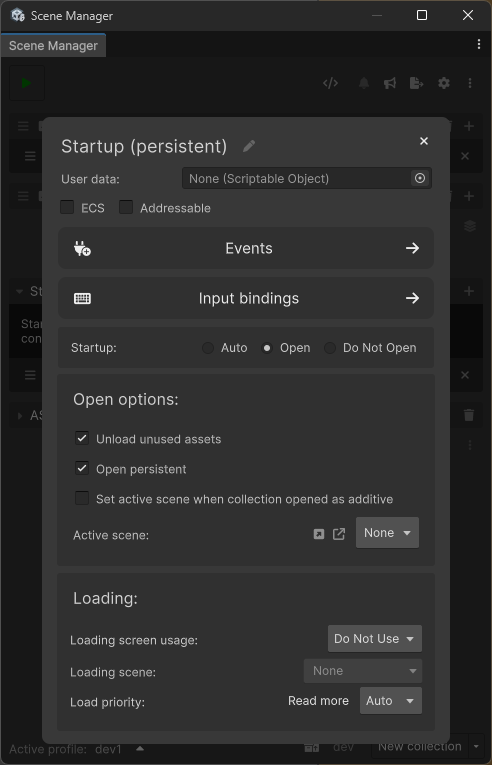

## Collection events
The **Events** subpage allows you to bind callbacks to collection lifecycle events.

These events are invoked when the collection is opened, closed, or when its open state changes.  
Bindings support runtime, editor, and test execution contexts depending on the selected target.

Typical use cases include:
- Triggering logic when a collection opens or closes
- Coordinating loading screens or transitions
- Running editor or debug utilities tied to collection state

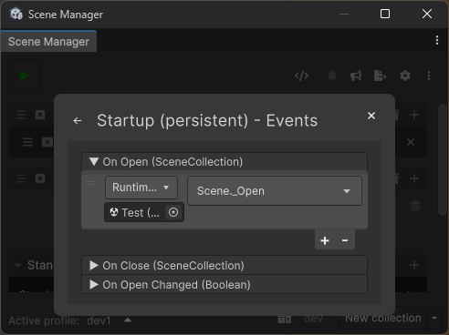

## Collection input bindings
The **Input bindings** subpage allows input actions to be mapped to collection operations.

Bindings can be used to open, close, or toggle collections using input events such as keyboard keys or input actions.

> Input bindings are hidden if the Input System package is not installed and enabled.

Scenes can also be excluded from triggering bindings using the *Scenes to ignore* list.

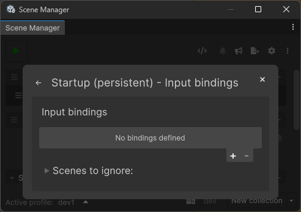

# Scene popup
The **Scene popup** configures behavior for an individual scene within ASM.

This includes scene persistence rules, loading behavior, editor behavior, events, and standalone-specific settings.

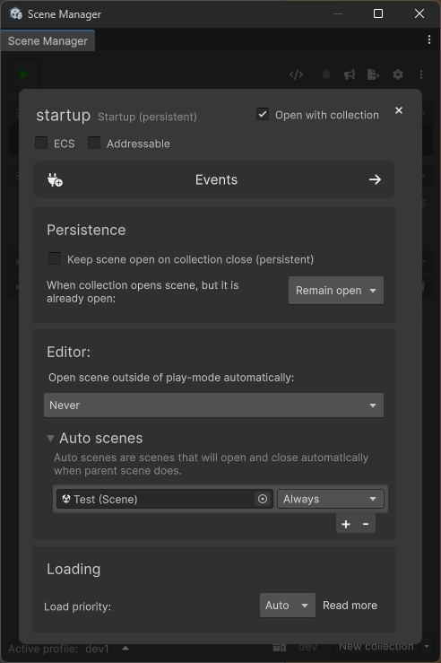

## Scene events
The **Scene events** subpage allows callbacks to be registered for scene-level lifecycle events.

Available events include:
- Scene open and close
- Preload and preload completion
- Collection-related open and close events
- Open state changes

These events are commonly used for scene initialization, teardown, or coordination with external systems.

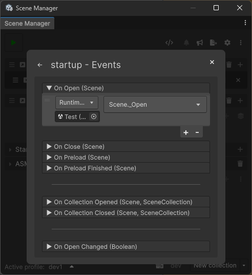

## Standalone scene
The **Standalone scene** subpage is available for scenes that are added to the [standalone collection](main.md#special-collections).

It allows standalone scenes to:
- Be opened at startup
- Be opened when entering play mode
- Respond to input bindings
- Define loading behavior independently

This is typically used for utility scenes, overlays, or scenes that should exist outside collection workflows.

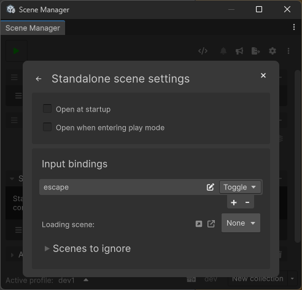

# Diagnostics popup
The **Diagnostics popup** provides insight into ASM’s internal state and initialization process.

It includes runtime statistics such as initialization timing, discovered elements, and active systems, and serves as an entry point to more detailed diagnostic views.

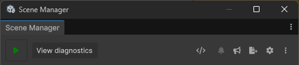\
_The button is hidden unless hovered._

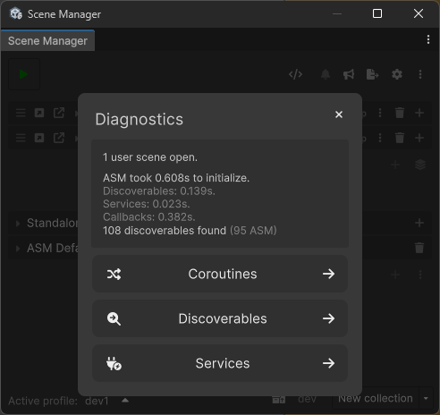

## Coroutine diagnostics
The **Coroutines** diagnostics view lists active and completed coroutines using ASM’s coroutine utility.

> CoroutineUtility can be used like so:
> ```csharp
> void StartCoroutine()
> {
>    CoroutineUtility.Run(() => Debug.Log("test"), after: TimeSpan.FromSeconds(2));
>    ExampleCoroutine().StartCoroutine();
> }
> IEnumerable ExampleCoroutine() 
> {
>    yield return new WaitForSeconds(1f);
> }
> ```

This is useful for:
- Debugging scene operations
- Tracking loading and transition phases
- Verifying event execution order

Each entry reflects the coroutine state and the event or operation it represents.

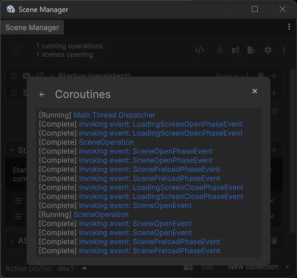

## Discoverable diagnostics
The **Discoverables** diagnostics view lists all discovered attribute callbacks such as `[ASMWindowElement]` and `[OnLoad]`.

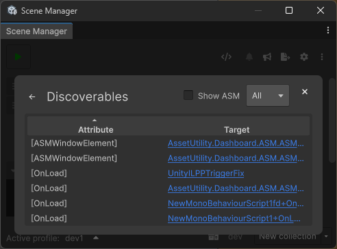

## Service diagnostics

The **Services** diagnostics view lists registered services and their implementations.

This allows you to inspect:
- Which services are currently registered
- Their concrete implementations

This view is useful for debugging the ASM DI container.

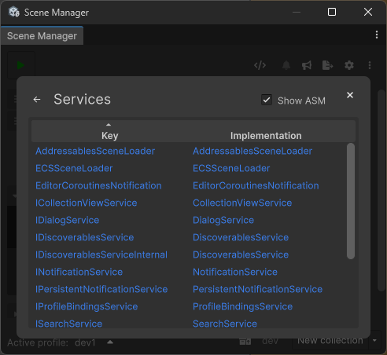

# Dynamic collection popup
The **Dynamic collection popup** is used to create and configure dynamic collections.

Dynamic collections reference a path instead of manually listed scenes.  
All scenes found at the specified path (and subfolders) are automatically included in builds, unless explicitly blacklisted.

Scenes do not need to be imported into ASM to be included through a dynamic collection.

This popup is typically used for workflows where scenes are generated, streamed, or otherwise managed externally. A common example is world streaming assets.

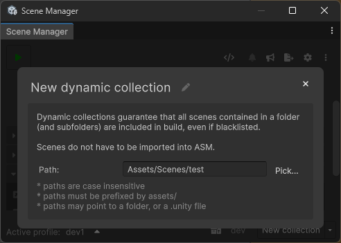

# Menu popup
The **Menu popup** provides general information about ASM and access to reference links.

Dev Build provides a quick way to build the project directly from the ASM window.

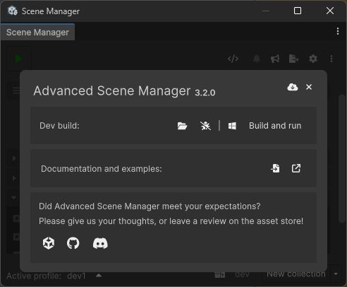

# Scene overview popup
The **Scene overview popup** displays a searchable list of all scenes known to ASM.  
This includes both imported and unimported scenes.

This popup is primarily intended for quick navigation and inspection in larger projects.

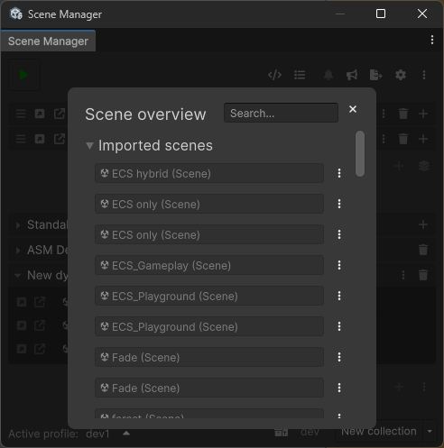

# Child profiles popup

The **Child profiles popup** is used to manage child profiles for the currently active ASM profile.

Child profiles are primarily an organizational feature for collections.  
They ensure that all scenes from all child profiles are included in the build.

The only additional behavior is support for startup collections:
- Collections marked as **Startup: Open** in child profiles will be opened
- **Startup: Auto** is ignored for child profiles

Pressing the edit button enters edit mode.

In edit mode, all profiles in the project are listed.  
Profiles can be checked to assign them as child profiles of the currently active profile.

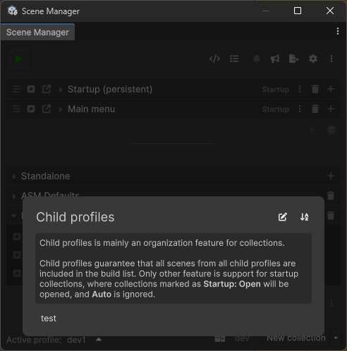

</br>

### Related pages
[📄 Main view](main.md)\
[📄 Settings popup](settings.md)\
[📄 Popups](popups.md)\
[📄 ASM utility functions](utility-functions.md)

[← Back](readme.md) | [🏠 Home](../readme.md)