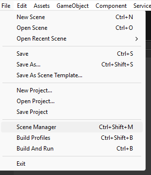
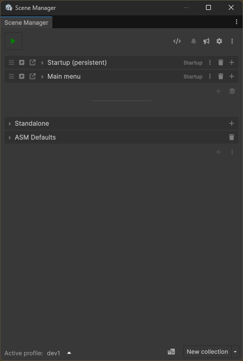

<!---asm-window/readme.md-->
[← Back](../readme.md) | [🏠 Home](../readme.md)
## ASM Window _(Scene Manager Window)_

The **ASM Window** is the primary editor UI for managing scenes and collections in ASM.\
It is used to define how scenes are grouped, opened, loaded, and included in builds, and acts as the central control point for your project’s scene setup.

[📄 Main view](main.md)\
[📄 Settings popup](settings.md)\
[📄 Popups](popups.md)\
[📄 ASM utility functions](utility-functions.md)

