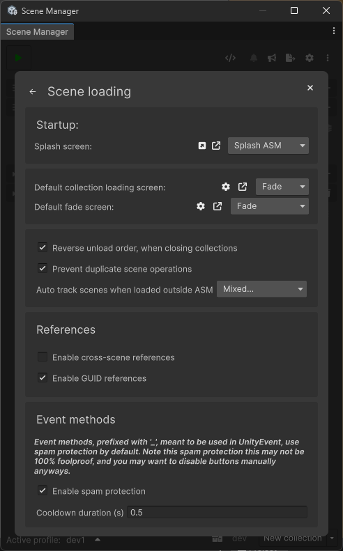
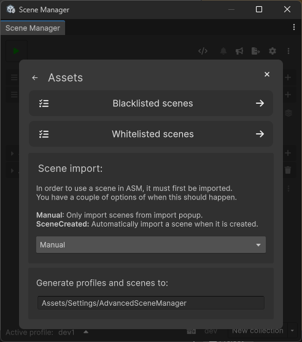
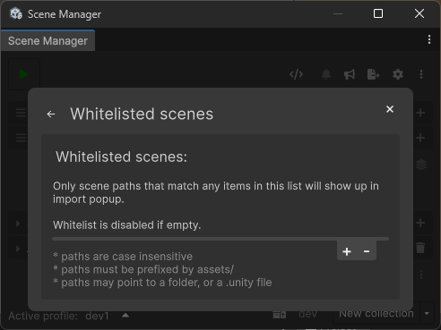
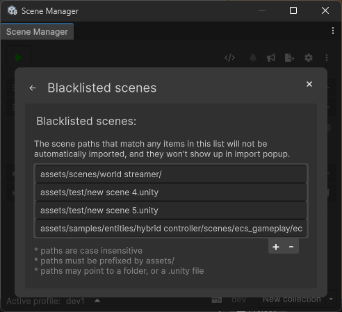
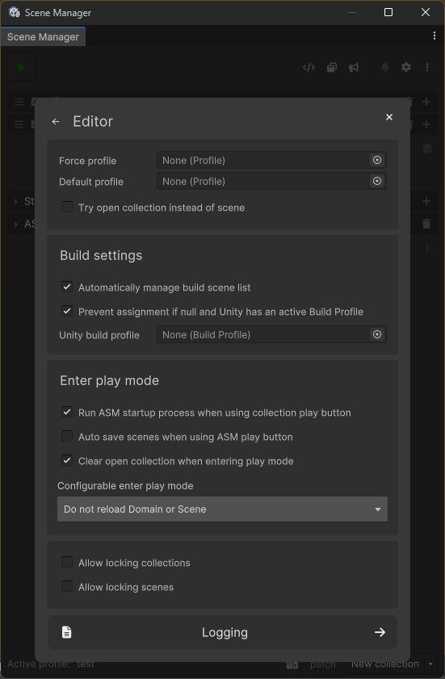
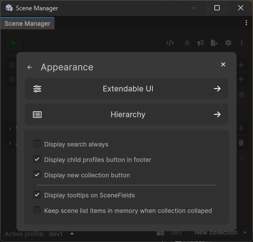
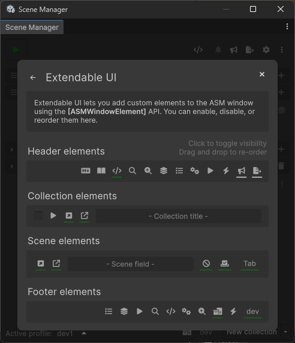
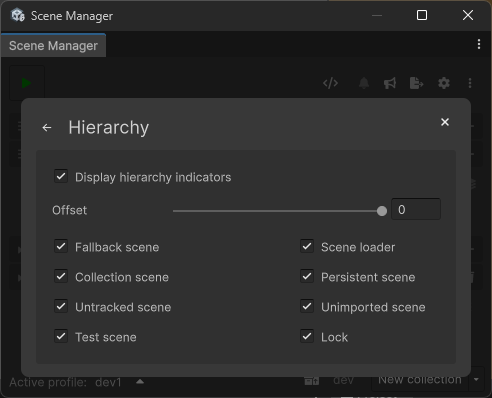
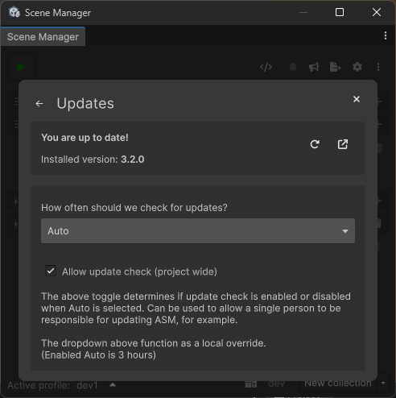
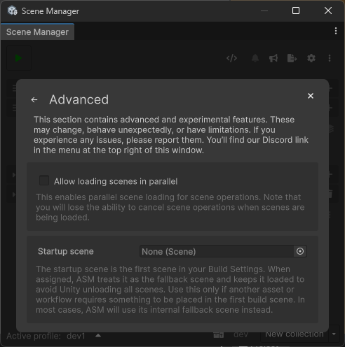

[← Back](readme.md) | [🏠 Home](../readme.md)
## Settings popup
### Overview

- [Scene loading page](#scene-loading-page)
- [Assets page](#assets-page)
	- [Whitelist subpage](#whitelist)
	- [Blacklist subpage](#blacklist)
- [Editor page](#editor-page)
	- [Logging subpage](#logging)
- [Appearance page](#appearance-page)
	- [Extendable UI subpage](#extendable-ui)
	- [Hierarchy subpage](#hierarchy)
- [Updates page](#updates-page)
- [Network page](#network-page)
- [Advanced page](#advanced-page)
	
## Scene loading page

The **Scene loading** page controls how ASM handles scene loading, unloading, tracking, and transitions, both at runtime and in the editor.

### Startup

- **Splash screen**  
  Specifies which splash screen setup should be used when ASM runs its startup process.  
  This includes opening collections and standalone scenes that are flagged to open during startup.

- **Default collection loading screen**  
  Defines the loading screen used when opening scene collections, unless a collection overrides it explicitly.

- **Default fade screen**  
  Defines the default fade-based loading screen used by certain APIs that rely on implicit transitions rather than explicit loading screens.

  This fade screen is used as a fallback by APIs such as:
  - Programmatic fade in and fade out calls
  - Scene operations that perform short, blocking actions
  - Utility methods that require a temporary visual transition but do not specify a loading screen

### Scene operation behavior

- **Reverse unload order when closing collections**  
  Ensures scenes are unloaded in the opposite order they were opened.  
  This helps reduce issues caused by implicit dependencies between scenes.

- **Prevent duplicate scene operations**  
  Attempts to prevent duplicate scene operations by validating planned open and close lists before execution.  
  This is not 100% reliable and should be considered a baseline safeguard only.  
  Users are still expected to avoid duplicate operations manually, which is the most reliable approach.

- **Auto track scenes loaded outside ASM**  
  For ASM to consider a scene open, it must be tracked.

  When opening a scene through ASM, it is tracked automatically.  
  When loading a scene outside of ASM (for example via `UnityEngine.SceneManagement.SceneManager.LoadScene`), the scene will remain untracked unless handled manually.

  Scenes can be tracked manually using `SceneManager.runtime.Track(scene)` if needed.

  This option allows ASM to attempt automatic tracking of externally loaded scenes. While helpful, this behavior is not foolproof and may fail in complex or non-standard loading scenarios.

### References

- **Enable cross-scene references**  
  Allows object references between scenes.

  > Unity does not officially support cross-scene references.  
  > As a result, warnings may appear and references may break unexpectedly.  
  > This is a workaround rather than a guaranteed solution.  
  > Make sure to thoroughly test any setup relying on cross-scene references.

- **Enable GUID references**  
  Enables GUID-based references, improving resilience when assets are moved or renamed.

  This enables the use of the `GUIDReference` script and `GUIDReferenceUtility`, and is required for cross-scene references to function.

### Event methods

- **Enable spam protection**  
  Adds automatic cooldown protection for event methods invoked through UnityEvents.  
  This applies specifically to ASM event methods prefixed with `_`, such as `_Open`.

- **Cooldown duration**  
  Specifies the minimum time, in seconds, between repeated event method invocations.

## Assets page

The **Assets** page controls how ASM manages its generated and imported assets.

- **Import mode**  
  Determines when scenes are imported into ASM:
  - **Manual**: Scenes are only imported via the import popup.
  - **SceneCreated**: Newly created scenes are automatically imported.

   

  > Scenes can also be imported manually via code using  
  > `SceneAsset.Import()` or `SceneImportUtility.Import("Assets/scene.unity")`.

- **Generate profiles and scenes to**  
  Specifies where ASM-generated assets are stored, including profiles, collections, and imported scenes.

### Whitelist

Controls which scenes are *allowed* to appear in the import popup.

- Only scenes matching the listed paths will be shown.
- The whitelist is disabled when empty.
- Paths are case-insensitive and must start with `Assets/`.
- Entries may reference folders or individual `.unity` files.

### Blacklist

Controls which scenes are *excluded* from appearing in the import popup.

- Blacklisted scenes are never imported automatically.
- They will not appear in the import popup.
- Useful for test scenes, samples, or generated content.
- Paths are case-insensitive and must start with `Assets/`.

> Scenes can be blacklisted or whitelisted directly from the scene import item context menu.

## Editor page

The **Editor** page controls how ASM behaves inside the Unity Editor.

### Profiles

- **Force profile**  
  Forces ASM to always use a specific profile while in the editor.

- **Default profile**  
  Profile selected on startup when no previously saved profile is available.

- **Try open collection instead of scene**  
  When opening a scene asset, ASM will attempt to open the first collection that contains the scene instead.

### Build settings

- **Automatically manage build scene list**  
  Keeps Unity’s Build Settings scene list synchronized with ASM collections.

- **Prevent assignment if null and Unity has an active Build Profile**  
  When this is enabled, ASM will **not write to the global Build Settings** if:
  
  - the current ASM profile has **no Unity build profile assigned**, and  
  - Unity currently has a **build profile active**
  
  Instead, ASM logs a warning and skips updating the build scene list.  
  This helps prevent accidentally modifying the wrong build configuration when working with multiple Unity build profiles.

- **Unity build profile**  
  Assigns a **Unity build profile** to the current **ASM profile**.
  
  When set, ASM writes the build scene list to this build profile.  
  When not set, ASM writes to Unity’s global Build Settings, unless blocked by the option above.

### Enter play mode

- **Run ASM startup process when using collection play button**  
  Controls whether the normal ASM startup process runs before entering play mode when using a collection play button.

- **Auto save scenes when using ASM play button**  
  Saves all open scenes before entering play mode.

- **Clear open collection when entering play mode**  
  Prevents collections opened in edit mode from remaining tracked as open in play mode.

- **Configurable enter play mode**  
  Controls Unity’s domain reload and scene reload behavior when entering play mode.  
  This setting directly modifies Unity’s own configuration and is exposed here for convenience and visibility.

## Logging subpage

The **Logging** page enables or disables specific logging categories.  
These logs are intended for debugging and diagnosing issues in ASM and should typically remain disabled during normal use.

## Appearance page

The **Appearance** page controls UI behavior and visual preferences for the ASM window.

### Window behavior

- **Display search always**  
  Keeps the search field permanently visible.

- **Display child profiles button in footer**  
  Shows the child profile button in the footer area.

- **Display new collection button**  
  Controls visibility of the “New Collection” button.

- **Display tooltips on SceneFields**  
  Enables hover tooltips for scene fields.

- **Keep scene list items in memory when collection collapsed**  
  Improves expand and collapse performance at the cost of increased memory usage.

### Extendable UI

This page allows configuring which extendable UI elements are visible in the ASM window, and in what order.  
Elements can be enabled, disabled, and reordered per section.

### Hierarchy

This page controls ASM hierarchy indicators displayed in Unity’s Hierarchy window.

> Does not work in new UI toolkit version in unity 6.3+

## Updates page

The **Updates** page controls how ASM checks for new versions.

- **Check for updates**  
  Allows manual update checks and navigation to release information.

  When update checks are set to automatic, the dropdown acts as a local override.  
  This allows, for example, a single person on a project to receive update notifications while others opt in manually.
  

## Advanced page

The **Advanced** page contains experimental or advanced configuration options.

> Settings on this page may change behavior significantly or have known limitations. Use these options with care, especially in production projects.

- **Allow loading scenes in parallel**  
  Enables parallel scene loading for faster operations.  
  Note that this disables the ability to cancel scene loads once started.

- **Startup scene**  
  Specifies the scene at build index 0.  
  Currently, this also functions as the fallback scene, overriding ASM’s internal fallback mechanism.

  This can cause issues if the same scene is also managed normally by ASM, as fallback scenes are loaded directly and bypass ASM tracking.  
  Opening the same scene manually through ASM can therefore lead to conflicts.

  Best practice is to avoid using the startup scene anywhere else in ASM-managed workflows.

  > Separation of the startup and fallback scenes is planned and will be worked on in a future patch.

 

### Related pages
[📄 Main view](main.md)\
[📄 Settings popup](settings.md)\
[📄 Popups](popups.md)\
[📄 ASM utility functions](utility-functions.md)

[← Back](readme.md) | [🏠 Home](../readme.md)