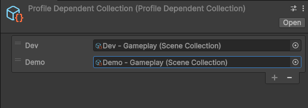

<!---models/ProfileDependentModel.md-->
[← Back](readme.md) | [🏠 Home](../readme.md)
## Models
### Profile Dependent Scenes and Collections

This feature works with both [Scene](./Scenes.md) and [SceneCollection](./Scene-collections.md).

**API References:**  
[ProfileDependent](/api/latest/Models/Utility/ProfileDependent_Of_T.md)  
[ProfileDependentCollection](/api/latest/Models/Utility/ProfileDependentCollection.md)  
[ProfileDependentScene](/api/latest/Models/Utility/ProfileDependentScene.md)

---

### What Is a Profile Dependent Model

A Profile Dependent Model allows you to reference scenes or collections across different profiles without tightly coupling them to a single one.

Instead of directly assigning a specific scene or collection, you assign a Profile Dependent version. At runtime, it automatically resolves the correct scene or collection based on the active profile.

This makes multi-profile setups more flexible and reliable, while keeping the API identical to regular [Scene](./Scenes.md) or [SceneCollection](./Scene-collections.md) usage.

**In short:**

- You can safely reference scenes or collections from any profile.  
- The correct version is resolved automatically.  
- No changes are required in your loading code.  

---

### Why Use It

Profile Dependent Models ensure:

- References remain valid across profiles.  
- Switching profiles does not require code changes.  
- Your loading logic stays clean and consistent.  

---

### How To Use

#### 1. Create a Profile Dependent Asset

Create a ScriptableObject from:

`Assets → Create → Advanced Scene Manager → ProfileDependentScene`  
or  
`Assets → Create → Advanced Scene Manager → ProfileDependentCollection`

You can also right-click in the **Project** window and create it from there.



---

#### 2. Assign It in Your Script

```csharp
public ProfileDependentCollection _collection;
public ProfileDependentScene _scene;

void LoadCollection() => _collection.Open();

void LoadScene() => _scene.Open();
```

### Related pages
[📄 Profiles](Profiles.md)\
[📄 Scene helper](Scene-helper.md)\
[📄 Scene collections](Scene-collections.md)\
[📄 Scenes](Scenes.md)\
[📄 Standalone scenes](Standalone-scenes.md)\
[📄 Profile dependent collections and scenes](ProfileDependentModel.md)

[← Back](readme.md) | [🏠 Home](../readme.md)


