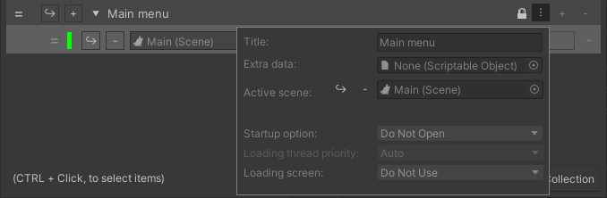
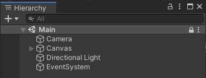
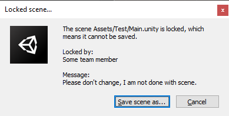

### Locking

The locking package adds support for locking scenes and collection from being edited.

> Note:
>
> We can only prevent edit from inside of unity.
>
> Any modifications from outside, including source control, cannot be prevented.

#### When saving scene:

When scene has been modified and user attempts to save, the following dialog will open, with customizable name and message:

> Save as:
>
> Opens file dialog to save as new scene.

> Cancel:
>
> Discards changes and reloads scene

Unlocking a collection or scene will display a similar dialog.
