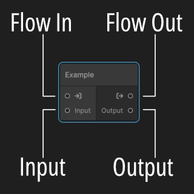

# Getting Started

If you have not yet familiarized yourself with ASM you should start there.

Build up your scenes and collection structures and when you are ready to start loading scenes with the flow manager follow the steps below.

Memorize the image below, In these guides or when communicating with us, this will most likely be how we call things.

## Open the editor

In the footer of ASM, you will now find a new icon (left of the scene helper) if you press it, the flow window will open, and if you drag it, you will access the flow helper.

## Flow Helper

The flow helper scriptable object works the same as the Scene helper, meaning you can run your flow from unity events or elsewhere. 

> Note that the flow helper is auto generated with methods to call your flows and variables. if something is missing in it, you may want to try regenerate... 

## Flow Editor Window

Lets start with familiarize ourselfs with the window. 

In the top left corner, you will find a menu to change flows or create new flows.
In the Top Right corner, you will find a menu to regenerate the code generation, if it did not trigger automatically.

In the top right, you have a inspector window where you see a few menus

Flow: Contains the settings for the selected flow.
Global Variables: will be explained in more details later.
Selection: The inspector for the selected node. 

## Flows

## Variables