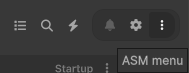
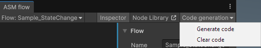
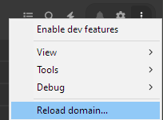

# Troubleshooting & Workarounds

This page covers common issues specifically related to the **Flow Editor**. For general Advanced Scene Manager issues (e.g., installation, compilation, or scene loading), please refer to the main [Workarounds](../workarounds.md) guide.

---

## Reporting Bugs

If you encounter an issue that isn't covered here, please reach out to us. To help us diagnose the problem quickly, please provide:

1. **Versions:** Your Unity version and ASM version (found in the ASM Menu).
2. **Logs:** Any errors or warnings appearing in the Console.
3. **Steps to Reproduce:** A brief description of what you were doing when the issue occurred.
4. **Context:** Are you using a specific Unity feature (like Addressables, URP/HDRP, etc.)?

---

## Flow-Specific Issues

### Flow Helper is missing "Run" or "Variables"
If the `FlowHelper` static class does not contain methods for your specific flows or variables, it means the **Code Generation** step hasn't been run yet.

**Solution:**
You must manually trigger code generation whenever you add or rename flows/variables. 

1. Open the **Flow Editor Window**.
2. Click the menu in the **Top Right** corner.
3. Select **Generate Code**.

**If it still doesn't work:**
- Check the Console for any compilation errors. Code generation can fail if there are existing errors in your project.
- Ensure your Flow assets have unique names and are saved within the project `Assets` folder.

---

### Missing Flows or Variables in the Editor
The Flow Editor uses an asset discovery system to keep track of your flows and variables. Occasionally, this system might miss an asset after it has been moved or renamed externally.

**Solution:**
- Locate the missing Flow or Variable asset in your Project window.
- **Right-click** the asset and select **Reimport**.
- This forces the discovery system to re-index the asset.

---

### ArgumentException when running a Flow
You may encounter the following error when trying to run a Flow:
`ArgumentException: Object of type 'UnityEngine.Object' cannot be converted to type 'AdvancedSceneManager.Flows.Models.Flow'.`

**Cause:**
This error occurs when `null` is passed into `ASMFlowHelper.Run(flow)`. This most commonly happens when using a **UnityEvent** (or similar) where the Flow reference has not been assigned in the Inspector.

**Solution:**
Ensure that the Flow asset is correctly assigned to the event or script call that is triggering the Flow.

> [!NOTE]
> We are aware that this error message is somewhat cryptic as it is generated by Unity's internal type conversion. We may look into providing a more descriptive error message or a validation check in a future update to make this easier to diagnose. *If possible.*

---

### Nodes are not appearing or showing errors
If nodes in your flow are missing or displaying "Unknown Node" errors:
- **Check for missing scripts:** Ensure you haven't deleted the script file for a custom node or uninstalled a package that provided those nodes.
- **Domain Reload:** ASM's internal caches can sometimes get out of sync. A domain reload often fixes this.

---

## General Troubleshooting

### The "Magic Fix": Domain Reload
Many temporary UI or state issues in Unity can be resolved by a **Domain Reload** (recompiling scripts). 

ASM provides a convenient shortcut for this in the **Dev Menu**:
1. Open the ASM Window.
2. **Right-click** the menu button (top-right).
3. Select **Recompile / Reload Domain**.

### Reimporting the Package
If you are seeing persistent unusual behavior or visual glitches after an update, try reimporting the entire `AdvancedSceneManager` and `Flow` folders. 
- Right-click the folder in the Project window and select **Reimport**.

---

## Useful Links
- [General Workarounds](../workarounds.md)
- [Common Questions](./Common-questions.md)
- [Getting Started](./Getting-Started.md)
