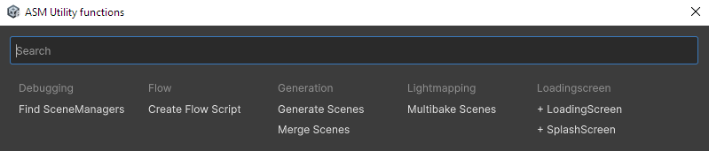

# Custom Nodes

There are two primary types of nodes you can create: **FlowNode** and **DataNode**.

- **FlowNode**  
  Controls execution. It features `Flow.In` and `Flow.Out` ports, along with any defined inputs or outputs. Use this for nodes that perform actions (e.g., loading a scene).

- **DataNode**  
  Used to retrieve or provide data. It does not control execution flow. Use this for nodes that perform calculations or return values (e.g., a math node).

## Creating Nodes

The simplest way to create new nodes is through the **ASM Utility Functions** menu.




## Community & Extra Nodes

The `Extra Nodes` folder typically contains user-contributed nodes or niche additions that are not part of the core package.

> **Contribute:** If you have developed useful nodes or have ideas for new ones, we encourage you to share them with the community!

## Technical Reference

When designing custom nodes, you may want to utilize the following features:

### Node Metadata
- **Description:** Provide a tooltip for your node to help users understand its purpose.
- **GetSummary:** Override this method to display dynamic text on the node itself (e.g., displaying the current value of a property).

### Inputs & Outputs
- **Fields vs Properties:** Use **public properties** for your `[Input]` and `[Output]` ports to ensure proper integration with the Flow Editor.
- **Dynamic Types:** Learn how to create ports that can accept multiple data types.
- **Renaming Ports:** You can customize the display names of your input and output fields for better clarity.

### Custom UI (UI Toolkit)
If you are familiar with Unity's **UI Toolkit**, you can fully customize the appearance of your nodes:
- **OnNodeViewRefreshed:** Override this method to add custom `VisualElements`, apply CSS classes, or modify the node's layout.
- **CreatePropertyGUI:** Use this to define how properties are drawn in the inspector.

### Node Lifecycle Events (`context.OnFlowEnd`)
When creating a **Custom Node**, you may need to perform cleanup or trigger an action specifically when the flow it belongs to finishes (whether it succeeds, fails, or is cancelled).

You can register a callback within the node's `Run` method using the `FlowContext`:

```csharp
public override async Awaitable Run(FlowContext context)
{
    // Register a method to run when the flow ends
    context.OnFlowEnd(() => 
    {
        Debug.Log("The flow has ended, performing cleanup...");
    });

    await Awaitable.MainThreadAsync();
}
```

### Advanced Design
- **Property Sheets:** Learn how to use property sheets for complex node data management.
- **AI-Assisted Creation:** While AI can help draft node logic, ensure you review any ASM-specific code, as general models may not be fully familiar with ASM's internal API.

---

## Useful Links
- [Events & Callbacks](../Events.md)
- [Getting Started](../Getting-Started.md)
- [Common Questions](../Common-questions.md)
- [Troubleshooting & Workarounds](../Workarounds.md)
- [Flow Documentation Index](../readme.md)

