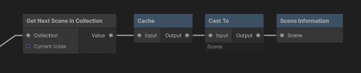

# Cache Node

The **Cache Node** is designed to store a computed value so you don't have to repeat complex evaluation steps or worry about underlying variables changing during backward evaluation.

## How It Works

Because ASM Flows evaluate their inputs backwards *at the exact moment a node executes*, relying directly on upstream data nodes or variables that might have been updated can sometimes cause out-of-sync data issues.

The Cache node acts as a safeguard:
- It **locks in** the data it receives the very first time it is evaluated.
- Subsequent backward evaluations that reach the Cache node will pull this locked value rather than recalculating the entire upstream chain.
- It automatically **resets** its stored value whenever a new flow run begins.

> **Note:** The Cache node saves data as an `object`. When retrieving this data later, you will need to cast it back to its original type.

## When to Use It

Use the Cache node when you *must* compute a value early in your flow and reuse it later, specifically when you want to guarantee that the value won't change even if other nodes (like **Set Variable**) modify the underlying state later in the flow's execution.

---
*For a visual breakdown of how backward evaluation can cause out-of-sync data, see the [Importance of Node Ordering](../Getting-Started.md#importance-of-node-ordering) section in the Getting Started guide.*
