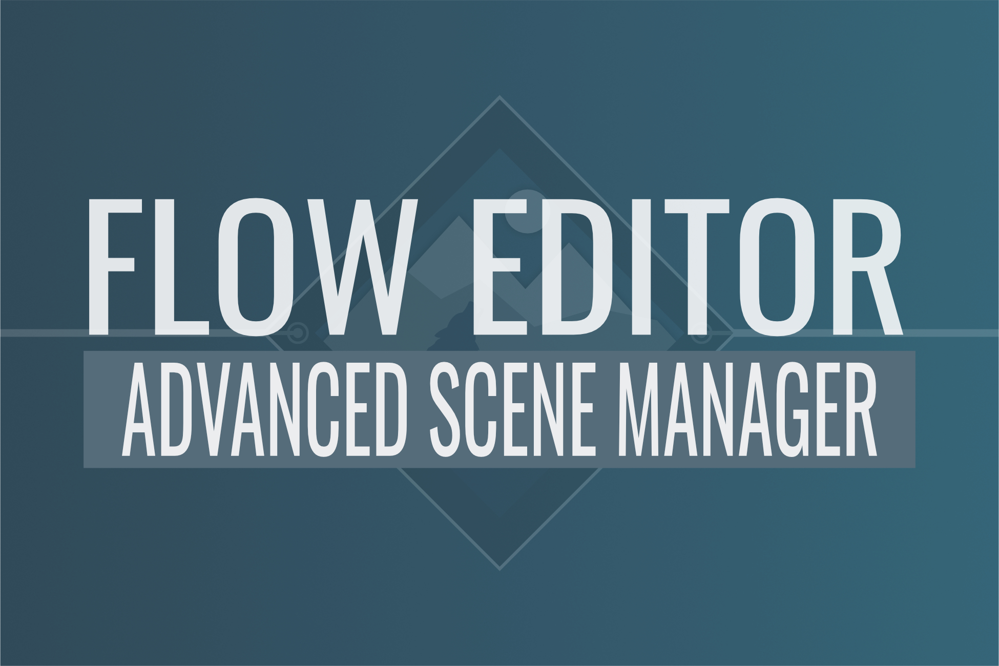

# Flow Editor for Advanced Scene Manager

Requires Advanced Scene Manager 3.3+

> Reporting bugs and suggesting improvements or nodes will increase the value of this package over time. We appreciate you reaching out!

## Introduction

The Flow Editor is a visual scripting layer for Advanced Scene Manager, designed to reduce the need for direct API interaction.

It allows you to build logic using nodes while still integrating fully with the core system.

This package also includes additional nodes and features that are kept separate from the main asset to avoid unnecessary complexity.

## Guides

- [Getting Started](./Getting-Started.md) — Learn the basics of the Flow Editor.
- [Events & Callbacks](./Events.md) — Interact with flows via code and global events.
- [Custom Nodes](./custom-nodes/Custom-Nodes.md) — Create your own logic nodes.
- [Common Questions](./Common-questions.md) — Frequently asked questions.
- [Troubleshooting & Workarounds](./Workarounds.md) — Solutions to common issues.

## Patches

Minor patches (1.0.X) are pushed to GitHub much earlier than to the Asset Store.

Major patches (1.X.0) are always pushed to the store and require you to uninstall the previous version first to prevent script errors.

---

## Useful Links
- [Getting Started](./Getting-Started.md)
- [Events & Callbacks](./Events.md)
- [Common Questions](./Common-questions.md)
- [Troubleshooting & Workarounds](./Workarounds.md)
- [Main ASM Documentation](../README.md)