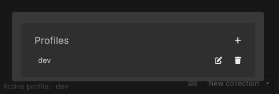

# Profiles

Profiles in ASM can be used to quickly switch between different configurations and scene setups.

Profiles contain:
* [Collections](Scene%20collections.md)
* [Dynamic collections](Scene%20manager%20window.md#dynamic-collections-and-scenes)
* [Standalone scenes](Standalone%20scenes.md)
* [Default loading screen](Scene%20manager%20window.md#scene-loading-page)
* [Splash screen](Scene%20manager%20window.md#startup-page)
* Various configuration settings found in [settings popup](Scene%20manager%20window.md#settings-popup)

The available profiles can be viewed, selected and created in the profile picker, in the bottom left of the [scene manager window](Scene%20manager%20window.md#footer).

Profiles can be forced for other team-members, see more [here](Scene%20manager%20window.md#editor-page).
